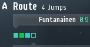

# 2019-07-10 Locate Objects in Screenshot

In this exploration, I want to learn more about how we can quickly test functions to read from screenshots. Reading from screenshots is the default method for a bot to learn about the current state of the (game)world. After the bot takes a screenshot of the game client, it applies functions to extract information out of the screenshot. A typical example is locating objects to interact with using mouse clicks.

Just as the bot development process in general, composing such an image processing function is an iterative process: Looking at an example image, I get an idea of how to model the pattern to search for and sketch the first approximation of the function. Then I run this function on the example image and review its output. Depending on the results I see there, I make changes to the image processing function. This cycle of testing and adjusting repeats until I have arrived at a version that produces the expected output for the example images.

Since bot developers run such tests hundreds of times per hour, I check that this process works smoothly.

Last weeks exploration ([2019-07-04.read-screenshot-from-file-and-configure-image-search](./../2019-07-04.read-screenshot-from-file-and-configure-image-search/app/src/Main.elm)) resulted in improvements in the same area: One of the results was a graphical user interface which allows a user to interactively load example screenshot and compose a function to search for objects in these screenshots.

What I miss in the result from last week: Support for testing any image processing function. The image pattern model developed there allows only to model a subset of these functions. After completing the last weeks' exploration, I became aware of some cases where that specific model was not flexible enough.

> ## Reminder About Image Representation  
>  
> What we can already see in last weeks exploration: The screenshot is represented as a set of pixels, each with a two-dimensional location and a value. This pixel value is composed of a numeric intensity for each of the three color channels red, green and blue.  
> In the type [`DecodeBMPImageResult`](./../2019-07-04.read-screenshot-from-file-and-configure-image-search/app/src/DecodeBMPImage.elm), the two-dimensional location of the pixel is modeled implicitly, as the index of the pixel in the list `pixelsLeftToRightTopToBottom` combined with the image property `bitmapWidthInPixels`.

## Initial Idea

The simplest way I found so far for this testing process:

+ Start from a test implementation. This is simply a bot code which we can run like any other bot, by specifying the `bot-source` location.
+ This template bot code contains all the functionality to load example images and render results from image processing to make review easy. It also contains a function which is responsible for the image processing part.
+ To test our own image processing function, we just replace that image processing function in the example bot code by our own, then run this code as usual.

This approach has the advantage that we reuse significant parts of the general bot development process, including the development environment which analysis the code and draws our attention to potential problems. This reuse ensures familiarity and minimizes required learning effort on the bot developers side.

## Demo Image

For testing during exploration, I save an example image to a file in this directory here. The example, in this case, is the screenshot from https://github.com/Viir/bots/blob/21e030d9b6d496a0d0b2e02e2eca1bea3dfb91d0/explore/2019-06-26.how-to-take-screenshots/2019-06-26.eve-online-screenshot.jpeg
To ensure the right image file format, I use the same ['save as BMP' process as last week](./../2019-07-04.read-screenshot-from-file-and-configure-image-search/app/tests/DecodeBMPImageTest.elm). To reduce the cost of the image file in the repository, I crop it before adding it here. The resulting file is in [`2019-07-11.example-from-eve-online-crop-0.bmp`](./2019-07-11.example-from-eve-online-crop-0.bmp):



## Implementation

A good outcome of this exploration would be completing a usable version of that bot code template as described above so that bot developers can start using it. To reduce the wait time for bot developers, the initial scope is reduced to contain only essential functionality.

For the image file decoding functionality, we can reuse the implementation `decodeBMPImageFile` from last weeks exploration, as this already maps from a file (`Bytes` type) to an image (`DecodeBMPImageResult` type).

Since we use the bot interfaces for the implementation, I start by copying the code of an existing bot. I use the bot from [implement/bot/eve-online/eve-online-warp-to-0-autopilot](./../../implement/bot/eve-online/eve-online-warp-to-0-autopilot) to start the implementation of the template.

### Loading a File Trough the Volatile Host

What does the bot need on the volatile host side? As far as I see now, returning the content of a file at a specified path is enough. Everything else can be implemented on the transparent side. The `SanderlingVolatileHostSetup.elm` file already contains the overall structure for running requests from the bot in the volatile host. The simplest way to implement the new file loading command seems to add it here analogous.

## Result

During the process of developing this template, I reduced the scope of applications: I concentrated on locating instances of an object in an image. Starting from this template also helps with other kinds of extracting information (e.g., a general classification) from a screenshot, but the guide added here focuses on the use-case of locating objects.

The template implemented in this exploration supports testing a function which should locate instances of an object in an image. It contains the framework to load and parse the image file and display the object search results for easy review. By looking at the test results and comparing them with the expectations, a bot developer can check if the object locating function works correctly.

The simplest way to locate instances of an object in an image is to provide a function with a type as follows:
```elm
image_shows_object_at_origin : ({ x : Int, y : Int } -> Maybe PixelValue) -> Bool
```

Where `PixelValue` is defined as follows:
```elm
type alias PixelValue =
    { red : Int, green : Int, blue : Int }
```

The function takes one parameter, which is itself a function: For a given pixel location, it returns the pixels value. Since the location could also be outside the image, the returned pixel value is wrapped in a `Maybe`.
As can be seen from the return type, this function only returns `True` or `False`. It just tells the framework if the searched object is present in the image. Since this function does not know the size of the image, it cannot attempt to search the whole image. It just searches at a single area, by looking at pixels at surrounding (relative) locations.

To get a list of object locations for an image, the framework calls this function several times, for shifted versions of the image.
The function `getMatchesLocationsFromImage` knows all pixels in the image, and calls `image_shows_object_at_origin` for each pixel. It supplies `image_shows_object_at_origin` with a pixel query function that shifts the location according to the current search origin location. Because of this shift, `image_shows_object_at_origin` can also find pixel values at locations in negative coordinate space (e.g. `{ x = -11, y = -3 }`).
Where the `image_shows_object_at_origin` returns true, the location which was `{ x = 0, y = 0 }` in the scope of `image_shows_object_at_origin` is the relative object location. The integrating function adds the search origin offset to compute the absolute object location in the image.

During this exploration, I also added an example implementation of `image_shows_object_at_origin`. This included example finds the four waypoint markers in the demo image created above.

To test the image search, start the code using the `start-bot` command, and supply the path to the image file using the `--bot-configuration` parameter. Starting the code is explained in detail in the guide at https://github.com/Viir/bots/blob/21e030d9b6d496a0d0b2e02e2eca1bea3dfb91d0/guide/how-to-use-eve-online-bots.md

When running the unmodified template on said demo image, the bot outputs the following result:

```text
I received 'path-on-local-machine\bots\explore\2019-07-10.read-from-screenshot\2019-07-11.example-from-eve-online-crop-0.bmp' as the path to the image to load.
Stopped with result: Decoded image: bitmapWidthInPixels: 153, bitmapHeightInPixels: 81
Found matches in 4 locations:
[ { x = 23, y = 57 }, { x = 33, y = 57 }, { x = 43, y = 57 }, { x = 53, y = 57 } ]
```

Further aspects we could expand on in a guide:

+ Detail connection between output quoted above and demo image. (Upper left corner).
+ Why is it the upper left corner? How would it be another relative location? Show example code change to make it lower right corner or center.
+ Visualize instantiation and image shift, the mapping between relative and absolute locations.
+ Demonstrate how we get false positives by relaxing the constraints (brightness, saturation) in the example.
+ Optional addition of a broad phase?
