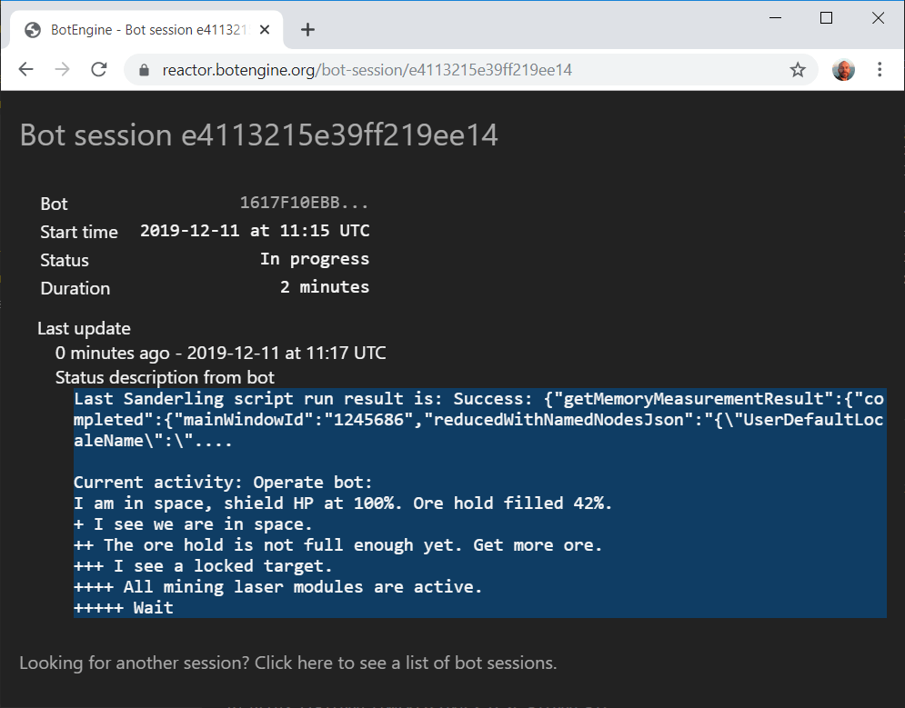
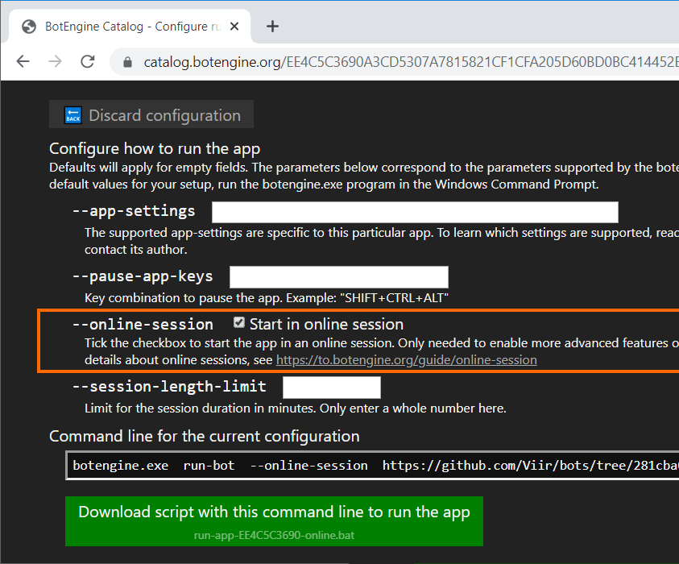
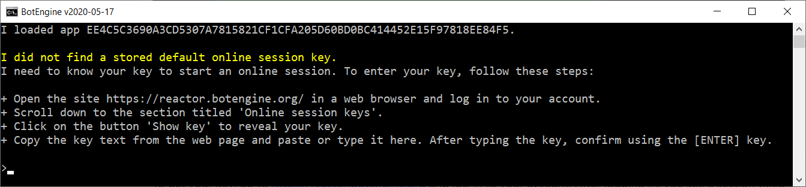
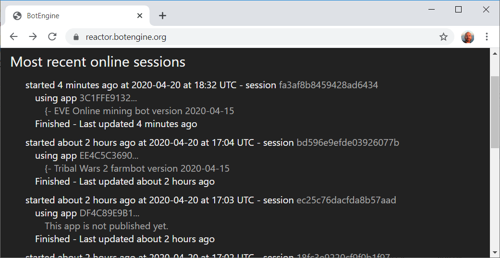

# BotLab Online Session

When running a bot, you can choose to start it in an online session. Online sessions provide several advantages over offline sessions:

+ Monitoring from other devices: No need to go to your PC to check the status of your bot. You can use your smartphone or any other device with a web browser to see the status of your bot.
+ Organize and keep track of your operations and experiments: Easily see which bots you already tested and when you used them the last time.
+ Longer running time: Run a bot continuously in one session for up to 72 hours.

To see a list of your most recent online sessions, log in at https://reactor.botlab.org

Below is a screenshot of the website you can use to view your online sessions and monitor your bots:


Online sessions cost 2000 credits per hour. When you log in to your account for the first time, you automatically get 1000 credits. Using these initial credits balance, you can test the online session feature without paying anything (Creating an account is free).
When you have used up the credits on your account, you can add more following the instructions at [https://reactor.botlab.org/billing/add-credits](https://reactor.botlab.org/billing/add-credits)

For more about purchasing and using credits, see the guide at https://forum.botlab.org/t/purchasing-and-using-botlab-credits-frequently-asked-questions-faq/837

### Starting an Online Session

In case you use the Command Prompt or PowerShell, you can start an online session by adding the `--online-session` option on the `botlab  run` command. Here is an example:
```cmd
botlab  run  --online-session  "https://github.com/Viir/bots/tree/25cd2fbc264b97bd15257bca6f3414e75f206b67/implement/templates/remember-app-settings"
```

If you don't use the Command Prompt, use the bot configuration interface on the catalog: Enable the checkbox labeled "Start in online session" as shown in this screenshot:



Then use the button "Download script with this command line to run the bot". The script file you get here starts the bot in an online session.

When you start a bot with a configuration for an online session, you might get this prompt from the botlab program:



Here you need to enter your online session key to continue.

To get your key, go to https://reactor.botlab.org and log in to your account. After logging in, you see a section titled `Online session keys`. In this section, there is an entry for a key, containing a button labeled `Show key`. Clicking this button reveals your key. Please don't share this key with anyone, and don't post it on the forum.


Copy the key from the web page and paste it into the botlab console window. Press the enter key to complete the input. BotLab then checks the key and continues to start the bot in an online session.

The BotLab client also stores the entered key in the Windows user account, so you don't have to enter it the next time you start an online session.

After the online session is started, you can also see it at https://reactor.botlab.org/ under `Most recent bot sessions`:




Clicking on the session ID brings you to the details view of the session, where you can also see the status reported by the bot.

The sessions under `Most recent bot sessions` are still available after stopping the BotLab client, so you can continue to view details of past sessions.

## Getting Help

If you have any questions, the [BotLab forum](https://forum.botlab.org) is a good place to learn more.
