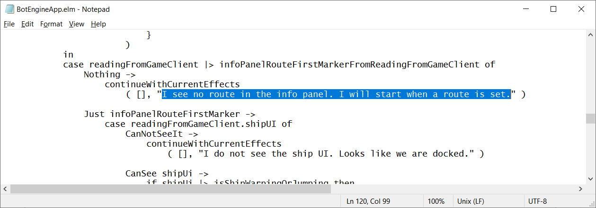

# Developing for EVE Online

Do you want to learn how to build a bot or intel tool for EVE Online or customize an existing one? This guide shows you how I make apps like these.

In part, this is a summary of my ~~failings~~ learnings from development projects. But most importantly, this guide lives from and evolves with your questions, so thank you for the feedback!

Wondering what outcome to expect? Two examples are the [mining bot](https://to.botengine.org/guide/app/eve-online-mining-bot) and [warp-to-0 autopilot](https://to.botengine.org/guide/app/eve-online-autopilot-bot).

## Scope and Overall Direction

My way of working is just one out of many, reflecting the kinds of projects I work on and my preferences. I select methods that are simple and easy to explain and lead to software with low maintenance costs.

For those who already have some experience in software development, I compiled the following overview of my technical decisions (If you have no experience in programming, this list probably is less interesting, feel free to skip it):

+ I do not write into the game client's memory or use injection. These techniques can allow for more direct control of the game. A downside of these methods is they enable CCP to detect the presence of the foreign program. Another reason I don't use injection is the more complex concept makes it harder to learn and maintain implementations. For my projects, I stay close to the user interface and control the game by sending mouse and keyboard input.

+ To get information about the game state and user interface, I use memory reading. Memory reading means reading directly from the memory of the game client process. So this guide does not cover the approach using image processing (sometimes called 'OCR') on screenshots. The implementation of memory reading comes from the Sanderling project; check out the [Sanderling repository](https://github.com/Arcitectus/Sanderling) to learn more about this part.

+ If I would make only a simple bot or even just a macro, I could as well use a programming language like C# or Python. I am using the Elm programming language because it is simpler to learn and works better for larger projects and AI programming. Especially the time-travel debugging is useful when working on bots.

+ One thing I learned from answering developer's questions is this: You want to make it easy for people to communicate what code they used and in which environment. If an app does not work as expected, understanding the cause requires not only having the program code but also knowing the scenario the app was used in. The data a app reads from its environment is the basis for its decisions, so I favor methods that make it easy to collect, organize, and share this data.

## The Simplest Custom App

In this section, we will follow the fastest way to your custom app.
First, let's look at one of the EVE Online apps in the example projects. Run this autopilot bot:

```cmd
botengine  run  "https://github.com/Viir/bots/tree/d33deb2ae2131e1a3d575e41f87c6b2b87f7009d/implement/applications/eve-online/eve-online-warp-to-0-autopilot"
```

If the botengine program is not yet installed on your system, you need to install it first, as described in the guide at https://to.botengine.org/failed-run-did-not-find-botengine-program

The `botengine run` command loads the app code from the given address to run it on your system. Before running this app, you need to start an EVE Online client, no need to go beyond character selection.

When the bot has started, it will display this message:

> I see no route in the info panel. I will start when a route is set.

That is unless you have set a route in the autopilot.

To customize this bot, we change the app code. The app code is made up of the files behind the address we gave to the botengine program.
To edit the app code files, we download them first. Use this link to download all the files packaged in a zip-archive: https://github.com/Viir/bots/archive/d33deb2ae2131e1a3d575e41f87c6b2b87f7009d.zip

Extract the downloaded zip-archive, and you will find the same subdirectory we used in the command to run the app: `implement\applications\eve-online\eve-online-warp-to-0-autopilot`.

Now you can use the `botengine run` command on this directory as well:

```cmd
botengine  run  "C:\Users\John\Downloads\bots-d33deb2ae2131e1a3d575e41f87c6b2b87f7009d\implement\applications\eve-online\eve-online-warp-to-0-autopilot"
```

Running this command gives you the same app with the same behavior because the app code files are still the same.

To change the app code, open the file `BotEngineApp.elm` in this directory in a text editor. For now, the Windows Notepad app is sufficient as an editor.

On [line 120](https://github.com/Viir/bots/blob/d33deb2ae2131e1a3d575e41f87c6b2b87f7009d/implement/applications/eve-online/eve-online-warp-to-0-autopilot/BotEngineApp.elm#L120), you find the text that we saw in the bots status message earlier, enclosed in double-quotes:



Replace that text between the double-quotes with another text:

```Elm
            case readingFromGameClient |> infoPanelRouteFirstMarkerFromReadingFromGameClient of
                Nothing ->
                    continueWithCurrentEffects
                        ( [], "Hello World! - I see no route in the info panel." )
```

When running the bot again from the local directory, you will see your change reflected in the status message in the console window.

### Getting Faster

Now you could generate random sequences of program text and test which ones are more useful. If you do this long enough, you will discover one that is more useful than anything anyone has ever found before.
But the number of possible combinations is too large to proceed in such a simple way. We need a way to discard the useless combinations faster.
In the remainder of this guide, I show how to speed up this process of discovering and identifying useful combinations.


## Navigation Basics

This chapter explains the foundations to navigate the implementation of an application, to be able to read the code and understand how different parts work together when the application runs.

To explore how a program works, we start from the part that you have already experience with: The observable behavior. From there, we work towards the parts which are invisible to the user, the implementation details.

On this journey, we will also pick up some basic vocabulary used in application development. Knowing the language will help you communicate with other developers and get help in case you need it.

### Effects

For the application to be useful, it needs to affect its environment in some way eventually. If it is a bot, it might send input to the game client. An intel tool, on the other hand, might play a sound. We have a common name for these observable consequences of running the application: We call them 'effects'.

### Events

To be able to decide which effects would be most useful, the application needs to learn about its environment. In our case, this environment is the game client. The application receives this information about the game client with events.

When programming an application, every effect originates from an event. An event can result in zero or multiple effects, but the application cannot issue an effect without an event. This constraint is not evident from a user's perspective because the user does not know when events happen. But knowing this rule helps to understand the structure of the program code.

### Event Response

This section explains the structure of the response of the application to an event (type `EveOnline.AppFramework.AppEventResponse`)
An important component of this response is the effects, as explained above. But besides the effects, the application can give some more information back to the framework to decide how the session continues. The responses are divided into two categories: `ContinueSession` and `FinishSession`.

Following are the components for a `ContinueSession` response (type `EveOnline.AppFramework.ContinueSessionStructure`):

+ `statusDescriptionText`: The text to display as status description from the app. You see this in the console window or on the session view on the web interface.
+ `effects`: The effects, as explained above.
+ `millisecondsToNextReadingFromGame`: You choose how many milliseconds the framework should wait before starting to acquire the next reading from the game client. If your app has some work to do, you might want to use several steps per second. Sometimes, you have to wait for some progress in the game world, idling. In these cases, choosing a lower update frequency can save processing resources and memory.

In case the app responds with `FinishSession`, the only component is the `statusDescriptionText`.

## Setting up the Programming Tools

This section introduces a setup to help us:

+ Understand a program: Syntax highlighting helps with reading. Navigation becomes easier with the ability to jump to definitions and find references.
+ Check our app code for problems: Static analysis detects errors after typing and before running an app.

To achieve this, we combine the following tools:

+ Elm command line program
+ Visual Studio Code
+ elmtooling.elm-ls-vscode
+ elm-format

The following subsections explain in detail how to set up these tools.

To test and verify that the setup works, you need the source files of an app on your system. You can use the files from https://github.com/Viir/bots/blob/d33deb2ae2131e1a3d575e41f87c6b2b87f7009d/implement/applications/eve-online/eve-online-warp-to-0-autopilot for this purpose.

### Elm command line program

The Elm command line program understands the [programming language](https://elm-lang.org/blog/the-perfect-bug-report) we use and [helps us](https://elm-lang.org/blog/compilers-as-assistants) find problems in the code we write.

Download the file from https://github.com/elm/compiler/releases/download/0.19.1/binary-for-windows-64-bit.gz

Extract the `binary-for-windows-64-bit.gz` file; this will get you a file named `binary-for-windows-64-bit`. Rename this to `elm.exe`, so the system will recognize it as an executable file. If you don't know how to extract `.gz` files, [7zip](https://www.7-zip.org) can do that.

Next, we perform a small test to verify the elm.exe program works on the app code as intended. Since `elm.exe` is a command line program, we start it from the Windows Command Prompt (cmd.exe).
Before starting the elm.exe, you need to navigate to the app code directory containing the `elm.json` file. You can use the `cd` command in the Command Prompt to switch to this directory, with a command like this:

```cmd
cd "C:\Users\John\Downloads\bots-d33deb2ae2131e1a3d575e41f87c6b2b87f7009d\implement\applications\eve-online\eve-online-warp-to-0-autopilot"
```

Now you can use elm.exe on the app code files with a command like the following:
```
"C:\Users\John\Downloads\binary-for-windows-64-bit\elm.exe" make BotEngineApp.elm
```
If everything works so far, the elm.exe will write an output which ends like the following:
```
Success! Compiled 10 modules.
```
or just

```
Success!
```

That number of modules it mentions can vary;

To see the detection of errors in action, we can now make some destructive change to the `BotEngineApp.elm` file. For example, simulate a typing mistake, on [line 123](https://github.com/Viir/bots/blob/d33deb2ae2131e1a3d575e41f87c6b2b87f7009d/implement/applications/eve-online/eve-online-warp-to-0-autopilot/BotEngineApp.elm#L123), replace `shipUI` with `shipUi`.
After saving the changed file, invoke Elm with the same command again. Now we get a different output, informing us about a problem in the code:


For development, we don't need to use the Elm program directly, but other tools depend on it. The tools we set up next automate the process of starting the Elm program and presenting the results inside a code editor.

### Visual Studio Code

Visual Studio Code is a software development tool from Microsoft, which also contains a code editor. This is not the same as 'Visual Studio', a commercial product from Microsoft. Visual Studio Code is free and open-source, and often abbreviated as 'VSCode' to better distinguish it from Visual Studio. To set it up, use the installer from https://code.visualstudio.com/download

### elmtooling.elm-ls-vscode

[elmtooling.elm-ls-vscode](https://marketplace.visualstudio.com/items?itemName=Elmtooling.elm-ls-vscode) is an extension for VSCode. It has multiple features to help with development in Elm programs such as our bots. An important one is the display of error messages inside the code editor. A more obvious feature is the syntax coloring in Elm files, as you will soon see.

To install this extension, open VSCode and open the 'Extensions' section (`Ctrl + Shift + X`).
Type 'elm' in the search box, and you will see the `Elm` extension as shown in the screenshot below:


Use the `Install` button to install this extension in VSCode.

Before this extension can work correctly, we need to tell it where to find the Elm program. Open the Visual Studio Code settings, using the menu entries `File` > `Preferences` > `Settings`.
In the settings interface, select the `Elm configuration` entry under `Extensions` in the tree on the left. Then you will see diverse settings for the elm extension on the right, as shown in the screenshot below. Scroll down to the `Elm Path` section and enter the file path to the elm.exe we downloaded earlier into the textbox. The screenshot below shows how this looks like:


VSCode automatically saves this setting and remembers it the next time you open the program.

To use VSCode with Elm, open it with the directory containing the `elm.json` file as the working directory. Otherwise, the Elm functionality will not work.
A convenient way to do this is using the Windows Explorer context menu entry `Open with Code` on the directory containing the code, as shown in the screenshot below:


Now we can test if our setup works correctly. In VSCode, open the `BotEngineApp.elm` file and make the same code change as done earlier to provoke an error message from Elm.
When you save the file (`Ctrl + S`), the VSCode extension starts Elm in the background to check the code. On the first time, it can take longer as required packages are downloaded. But usually, Elm should complete the check in a second. If the code is ok, you will not see any change. If there is a problem, this is displayed in multiple places, as you can see in the screenshot below:

+ In the file tree view, coloring files containing errors in red.
+ On the scroll bar in an open file. You can see this as a red dot in the screenshot. This indicator helps to scroll to interesting locations in large files quickly.
+ When the offending portion of the code is visible in an editor viewport, the error is pointed out with a red squiggly underline.


When you hover the mouse cursor over the highlighted text, a popup window shows more details. Here you find the message we get from Elm:


### elm-format

elm-format is a tool we use to format the text in the apps code files. This tool arranges program codes in a standard way - without changing the function. This consistent formatting makes the code easier to read. Using this standardized layout is especially useful when collaborating with other people or asking for help with coding.

The easiest way to use elm-format is by integrating it with VSCode, the same way as we did with the Elm command line program above.

You can download a zip-archive containing the executable program from https://github.com/avh4/elm-format/releases/download/0.8.3/elm-format-0.8.3-win-i386.zip
Extracting that zip-archive gets you the file `elm-format.exe`.

To integrate it with VSCode, navigate again to the `Elm LS` extension settings as we did for the other settings earlier. Here, enter the path to the `elm-format.exe` file in the text box under `Elm Format Path`, as shown in this image:


Now you can invoke the formatting using the `Format Document` command in the VSCode editor. An easy way to test if the formatting works is to open an `.elm` file from the example projects and add a blank line between two functions. As we can see in the example projects, the standard format is to have two empty lines between function definitions. When you add a third one in between, you can see it revert to two blank lines as soon as you invoke the formatting.

## App Code Structure

In 'The Simplest Custom App' section, we already changed the code in the `BotEngineApp.elm` file. This section explains how this file is structured, so we better understand what we are doing in there.

### Entry Point - `processEvent`

Each time an event happens, the framework calls the function [`processEvent`]https://github.com/Viir/bots/blob/d33deb2ae2131e1a3d575e41f87c6b2b87f7009d/implement/applications/eve-online/eve-online-warp-to-0-autopilot/BotEngineApp.elm#L63-L68). Because of this unique role, this function is sometimes also referred to as 'entry point'.

Let's look at how this function is implemented:

```Elm
processEvent : InterfaceToHost.BotEvent -> State -> ( State, InterfaceToHost.BotResponse )
processEvent =
    EveOnline.AppFramework.processEvent
        { processEvent = processEveOnlineBotEvent
        , parseAppSettings = AppSettings.parseAllowOnlyEmpty ()
        }
```

This function delegates the interesting part to the function `processEveOnlineBotEvent`.

Let's look at the type annotation of `processEveOnlineBotEvent`, the first lines of the function's source code:

```Elm
processEveOnlineBotEvent :
    EveOnline.AppFramework.AppEventContext ()
    -> EveOnline.AppFramework.AppEvent
    -> BotState
    -> ( BotState, EveOnline.AppFramework.AppEventResponse )
[...]
```

I will quickly break down the Elm syntax here: The part after the last arrow (`->`) is the return type. It describes the shape of values returned by the app to the framework. The part between the colon (`:`) and the return type is the list of parameters. So this function has three parameters.

Let's have a closer look at the parameters:

+ `EveOnline.AppFramework.AppEvent`: This describes an event that happens during the operation of the app.
+ `BotState`: The `BotState` type is specific to the app. With this type, we describe what the app remembers between events. When the framework informs the app about a new event, it also passes the `BotState` value which the app returned after processing the previous event. But what if this is the first event? Then there is no previous event? In this case, the framework takes the value from the function `initState`.

All information the app ever receives is coming through the values given with the first and second parameter (`AppEventContext` and `AppEvent`).

Just like the structure of the `BotState` type, its name is also specific for the app. We could as well use another name, as long as we use it consistently in both the last parameter and the return type.

## Programming Language

#### Custom Types

Custom types are also called tagged union types or algebraic data types. In the documentation about Elm, the term 'Custom Type' seems to be more popular.

Let's look at how a custom type with a type parameter can be used to compose more specific types. I will take a popular example of such a type. This one is often used to describe what can be seen on the screen.

```Elm
type MaybeVisible feature
    = CanNotSeeIt
    | CanSee feature
```

In this type definition, we have a type parameter called `feature`. We can instantiate the `MaybeVisible` type by specifying what to use as `feature`. For example, we can use the type `Bool` as the `feature`:

```Elm
type alias MaybeVisibleBool =
    MaybeVisible Bool
```

The type `MaybeVisible Bool` can have three different values:

+ `CanNotSeeIt`
+ `CanSee True`
+ `CanSee False`

In the larger context, this combination could be used as follows:
```Elm
type alias EveOnlineVision =
    { shipOreHoldIsFull : MaybeVisible Bool
    }


describeWhatWeSee : EveOnlineVision -> String
describeWhatWeSee vision =
    case vision.shipOreHoldIsFull of
        CanNotSeeIt ->
            "I can not see if the ship's ore hold is full. Do we need to change the setup?"

        CanSee True ->
            "The ship's ore hold is full."

        CanSee False ->
            "The ship's ore hold is not full."
```

----

Any questions? The [BotEngine forum](https://forum.botengine.org) is the place to meet other developers and get help.
