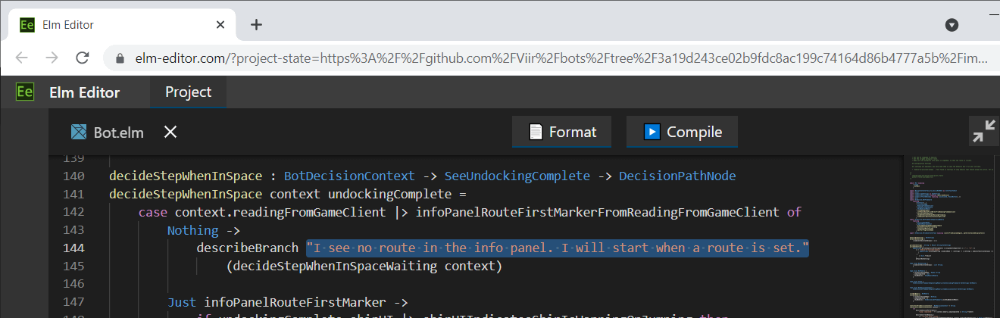
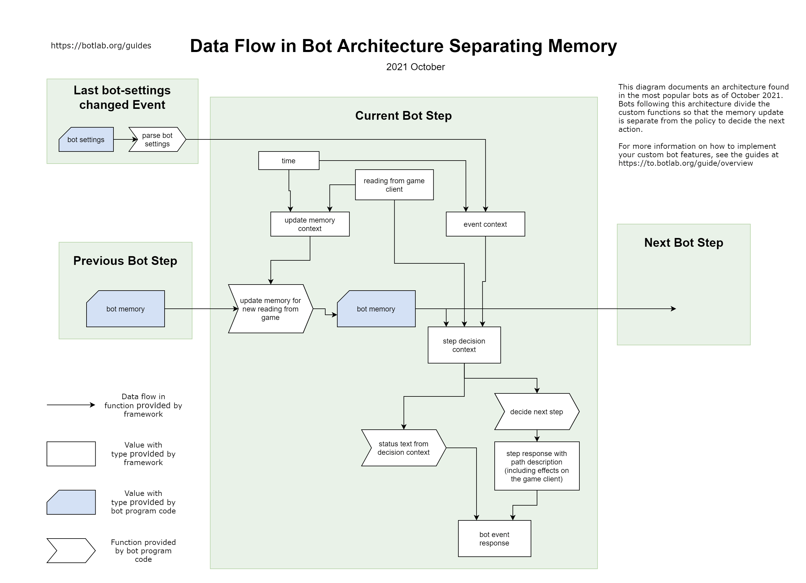

# Developing for EVE Online

Do you want to learn how to build a bot or intel tool for EVE Online or customize an existing one? This guide shows you how I make apps like these.

In part, this is a summary of my ~~failings~~ learnings from development projects. But most importantly, this guide lives from and evolves with your questions, so thank you for the feedback!

Wondering what outcome to expect? Two examples are the [mining bot](https://to.botlab.org/guide/app/eve-online-mining-bot) and [warp-to-0 autopilot](https://to.botlab.org/guide/app/eve-online-autopilot-bot).

## Comparing to Alternatives

The approach shown in this guide is just one out of many. How does it compare to, and how is it different from alternatives? I am not very patient with learning about all the details of underlying software or even hardware. To take the fastest route to a working app, I often build on libraries and tools that automate common tasks.
I select methods that are simple and easy to explain and lead to software with low maintenance costs. These qualities are more important to me than squeezing out the last percent of performance.

For those who already have some experience in software development, the following list details the technical choices that follow these preferences. If you have no programming experience, this list probably is less interesting, feel free to skip it:

+ I do not write into the game client's memory or use injection. These techniques can allow for more direct control of the game, which can bring some advantages. A downside of these methods is they enable CCP to detect the presence of the foreign program. Another reason I don't use injection is the more complex concept makes it harder to learn and maintain implementations. The approach to controlling the game client here is simulating mouse and keyboard input.

+ To get information about the game state and user interface, I use memory reading. Memory reading means reading directly from the memory of the game client process. So this guide does not cover the approach using image processing or 'OCR' on screenshots. The implementation of memory reading comes from the [Sanderling project](https://github.com/Arcitectus/Sanderling)

+ For a simple bot or macro, I could use a programming language like C# or Python. I use the Elm programming language because it is simpler to learn and works better for larger projects and makes collaboration easier. Especially the time-travel inspection and simulations are useful when working on bots.

+ Countless questions from other people taught me this: You want to make it easy for people to communicate what code they used and in which environment. If a bot does not work as expected, understanding the cause requires not only having the program code but also knowing the scenario in which the bot ran. The data a bot reads from its environment is the basis for its decisions, so I favor methods that make it easy to collect, organize, and share it.

## The Simplest Custom Bot

In this section, we take the fastest way to a custom bot.
First, let's look at one of the EVE Online bots in the example projects. Run this autopilot bot:

```cmd
botlab  run  "https://github.com/Viir/bots/tree/3a19d243ce02b9fdc8ac199c74164d86b4777a5b/implement/applications/eve-online/eve-online-warp-to-0-autopilot"
```

In case the BotLab client program is not yet installed on your system, the script will redirect you to the installation guide at https://to.botlab.org/guide/how-to-install-the-botlab-client-and-register-the-botlab-command

The `botlab run` command loads the program code code from the given address to run it on your system. Before running this bot, you need to start an EVE Online client, no need to go beyond character selection.

When the bot has started, it will display this message:

> I see no route in the info panel. I will start when a route is set.

That is unless you have set a route in the autopilot.

To customize this bot, we change its program code. The program code consists of the files behind the address we gave to the BotLab program.

The easiest way to work on program codes is using the Elm Editor at https://elm-editor.com

In this editor, we can load program code files, edit the code and get assistance in case of problems.

You can use the 'Load Project from Git Repository' dialog in Elm Editor to load any bots program code that is located on GitHub, such as the one we used above.

After loading the program files into Elm Editor, select the `Bot.elm` file to open in the code editor.

Here is a link that brings you directly into the `Bot.elm` file in Elm Editor, automating the import steps described above: https://elm-editor.com/?project-state=https%3A%2F%2Fgithub.com%2FViir%2Fbots%2Ftree%2F3a19d243ce02b9fdc8ac199c74164d86b4777a5b%2Fimplement%2Fapplications%2Feve-online%2Feve-online-warp-to-0-autopilot&file-path-to-open=Bot.elm

You can use the 'Export Project to Zip Archive' dialog in Elm Editor to download the current state of the program files.
Then you can run that bot by pointing the botlab client to this downloaded zip archive, with a command like this:

```cmd
botlab  run  "C:\Users\John\Downloads\elm-app-20948c30a689c55a5540bbd2e33436da27e7273c299bdcae051612a4256ea2df.zip"
```

Now that we know how to run a program code from the editor let's change it to make it our own.

In the `Bot.elm` file on line 144, we find the text that we saw in the bots status message earlier, enclosed in double-quotes:



Replace that text between the double-quotes with another text:

```Elm
    case context.readingFromGameClient |> infoPanelRouteFirstMarkerFromReadingFromGameClient of
        Nothing ->
            describeBranch "Hello World! - I see no route in the info panel. I will start when a route is set."
                (decideStepWhenInSpaceWaiting context)
```

After changing the program code, use the 'Export Project to Zip Archive' dialog again to get the complete program code in a runnable format.
Running our new version, we see the change reflected in the bot's status text.

### Getting Faster

Now you could generate random sequences of program text and test which ones are more useful. If you do this long enough, you will discover one that is more useful than anything anyone has ever found before.
But the number of possible combinations is too large to proceed in such a simple way. We need a way to discard the useless combinations faster.
In the remainder of this guide, I show how to speed up this process of discovering and identifying useful combinations.

## Observing and Inspecting a Bot

An improvement to a bots program code begins with observation of the behavior of the bot in an environment. Environments can be synthetic, simulated, or an actual live game client.

To learn how to observe and inspect the behavior of a bot, see the guide at https://to.botlab.org/guide/observing-and-inspecting-a-bot

## Overall Program Code Structure and Data Flow

In the 'The Simplest Custom Bot' section, we changed the code in the `Bot.elm` file to customize a bot. Because we only made a simple change, we could do it without understanding the program code's overall structure. The more we want to change, the more we benefit from understanding how everything works together.

This chapter explains the program code's overall structure and how data flows when the bot runs.

To explore how a program works, we start from the part that you have already experience with: The observable behavior. From there, we work towards the parts which are invisible to the user, the implementation details.

On this journey, we will also pick up some basic vocabulary used in bot development. Knowing the language will help you communicate with other developers and get help in case you need it.

### Effects

For the bot to be useful, it needs to affect its environment in some way eventually. If it is a bot, it might send input to the game client. An intel tool, on the other hand, might play a sound. We have a common name for these observable consequences of running the bot: We call them 'effects'.

Following is a list of effects available in our framework:

+ Move the mouse cursor to a given location. (Relative to the game window (The client area of that window to be more specific))
+ Press a given mouse button.
+ Release a given mouse button.
+ Press a given keyboard key.
+ Release a given keyboard key.

These effects are not specific to EVE Online, which is why we use functions from the code module `Common.EffectOnWindow` to describe these effects.

### Events

To be able to decide which effects would be most useful, the bot needs to learn about its environment. In our case, this environment is the game client. The bot receives this information about the game client with events.

When programming a bot, every effect originates from an event. An event can result in zero or multiple effects, but the bot cannot issue an effect without an event. This constraint is not evident from a user's perspective because the user does not know when events happen. But knowing this rule helps to understand the structure of the program code.

In our framework for EVE Online, the events are simplified as follows: The only event that we customize is the arrival of a new reading from the game client. If we were using a more general framework, we had other kinds of events too. One example is when the user changes the bot-settings, which can happen at any time. Our framework will not notify us every time the bot-settings change. Instead, it forwards us the bot-settings and other contextual information together with the next new reading from the game client. Another critical piece of context is the current time. The time too is forwarded only with the following new reading from the game client.

### Bot Program Code Structure - Framework For EVE Online

To make development easier, we can use one of the frameworks available for EVE Online.
Using a framework is a tradeoff between flexibility and ease of use. You can compare it to using Microsoft Windows instead of building your custom operating system: Using this platform, we can avoid learning about lower levels of the software stack, like a machine programming language.
In this guide, I use the most mainstream framework evolved from the works of some hundred EVE Online users and developers. When you look at the example projects, you will find that many kinds of bots use the same framework. It is flexible enough to cover activities like mining, ratting, trading, and mission running.
This framework's program code is included with the overall program code in the subdirectory named `EveOnline`. This makes it easier to look up a definition of a framework function.
You can code all your customizations in the `Bot.elm` file. When you compare the files making up the example bots, you will find that the different bots only differ in the `Bot.elm` file. At the beginning of that code module, these bots import building blocks from other code modules of the framework, namely `EveOnline.BotFramework`, `EveOnline.BotFrameworkSeparatingMemory` and `EveOnline.ParseUserInterface`.
These three modules contain hundreds of building blocks to compose your bot.

### Entry Point - `botMain`

In the `Bot.elm` file of each bot program code, you can find a declaration named [`botMain`](https://github.com/Viir/bots/blob/3a19d243ce02b9fdc8ac199c74164d86b4777a5b/implement/applications/eve-online/eve-online-warp-to-0-autopilot/Bot.elm#L242-L254).

In contrast to other declarations in that file, `botMain` has a unique role. Any other declaration can contribute to the bots behavior only if it is somehow referenced by `botMain`, directly or indirectly. Because of its unique role, we also call it the 'entry point'.

The type of `botMain` is not specific to EVE Online. Bots for other games use the same structure. Program codes for the EVE Online client use functions from `EveOnline.BotFrameworkSeparatingMemory` module to build the more general `botMain` value. We can see this in the example projects, no matter if it is a mining bot, ratting bot, or just a monitor that watches local chat and alerts the user when a hostile pilot enters. 

Here is how the [autopilot example bot code](https://github.com/Viir/bots/blob/3a19d243ce02b9fdc8ac199c74164d86b4777a5b/implement/applications/eve-online/eve-online-warp-to-0-autopilot/Bot.elm#L242-L254) uses framework functions to configure the bot:

```Elm
botMain : InterfaceToHost.BotConfig State
botMain =
    { init = EveOnline.BotFrameworkSeparatingMemory.initState initBotMemory
    , processEvent =
        EveOnline.BotFrameworkSeparatingMemory.processEventWithImageProcessing
            { parseBotSettings = parseBotSettings
            , selectGameClientInstance = always EveOnline.BotFramework.selectGameClientInstanceWithTopmostWindow
            , screenshotRegionsToRead = screenshotRegionsToRead
            , updateMemoryForNewReadingFromGame = updateMemoryForNewReadingFromGame
            , decideNextStep = autopilotBotDecisionRoot
            , statusTextFromDecisionContext = statusTextFromDecisionContext
            }
    }
```

In the snippet above, our program code composes the bot by combining multiple values from `Bot.elm` using the framework.

Using the `parseBotSettings` field, we configure how to parse the user's bot settings string into a structured representation. The bot-settings offer a way to customize bot behavior without changing the bot code. We can use any type we want for our bot settings.

### Data Flow for a Bot Step

The framework structures the execution of our bot as a series of 'bot steps'. Every time a new reading from the game client is complete, the framework performs one such bot step.

The information going into a bot step contains:

+ The reading from the game client.
+ The current time.
+ bot-settings, structure as parsed earlier.
+ The planned session duration.

The result from a bot step contains:

+ Do we finish the session now, or do we continue? If we continue the session, what is the sequence of inputs we send to the game client?
+ The new status text to display to the user.

Of the five elements that we gave to the framework in the code snippet above, it uses the following three in each bot step:

+ `updateMemoryForNewReadingFromGame`: Here, we define anything we might need to remember in future bot steps. We use this memory to remember observations about the game world that we need to make decisions in the future: Which asteroid belts are already depleted? Which anomalies contains dangerous rats that we want to avoid? Another application of this memory is tracking performance statistics: How many rats have we killed in this session?

+ `decideNextStep`: Here, we decide how to proceed in the session: Do we continue or finish the session? If we continue, which inputs do we send to the game client?

+ `statusTextFromDecisionContext`: Here, we add to the status text displayed by the whole bot. We expand this status text, for example, to show the performance metrics of our bot.


The `decideNextStep` and `statusTextFromDecisionContext` run in parallel. They do not depend on each others output, but both depend on the return value from `updateMemoryForNewReadingFromGame`.

The diagram below visualizes the data flow for a single bot step:



The arrows in this diagram illustrate how the framework forwards data between the functions we supplied to compose the bot.

### `parseBotSettings`

The framework invokes the `parseBotSettings` function every time the user changes the bot-settings. The return type is a kind of `Result` which means we can decide that a given bot-settings string is invalid and reject it. The `Err` case uses the `String` type, and we use this to explain to the user what is wrong with the given bot-settings string. In most cases, you don't want to code the parsing and generation of error messages for the user from scratch. There is a framework that parses settings strings based on a list of settings that you specified. Using this framework makes it trivial to add new settings. In our bot, we only need to define a list of valid settings, and the framework will generate a precise error message if the user misspells the name of a setting or tries to use a setting with an unsupported value.


## Programming Language

The bots here are mainly written using the Elm programming language. Many bots also contain a small portion of glue code in other languages like C#, but thanks to the framework, you don't even need to read these low-level parts.

### An Introduction to Elm

A great resource to learn about the Elm programming language is the official guide at https://guide.elm-lang.org

Parts of this guide are specific to web applications and less interesting when building bots. However, it also teaches fundamentals, which are very useful for us, specifically ["Core Language"](https://guide.elm-lang.org/core_language.html) and ["Types"](https://guide.elm-lang.org/types/).
And if you want to get into even more detail: The [Appendix](https://guide.elm-lang.org/appendix/function_types.html) covers more advanced topics, helping to understand not only how to write apps, but also how the framework is built.

### Types

Types are an important tool we get with the programming language. The type system allows the engine to draw our attention to problems in the program code before we even run an app. In the program code of examples, you can find many descriptions of types on lines starting with the "type" keyword. Here are two examples:

```Elm
type alias DronesWindow =
    { uiNode : UITreeNodeWithDisplayRegion
    , droneGroups : List DronesWindowDroneGroup
    , droneGroupInBay : Maybe DronesWindowDroneGroup
    , droneGroupInLocalSpace : Maybe DronesWindowDroneGroup
    }
```

```Elm
type ShipManeuverType
    = ManeuverWarp
    | ManeuverJump
    | ManeuverOrbit
    | ManeuverApproach
```

The guide on the Elm programming language has a chapter ["Types"](https://guide.elm-lang.org/types/), and I recommend reading this to learn what these syntaxes mean. This chapter is also worth a look if you encounter a confusing "TYPE MISMATCH" error in a program code. In the ["Reading Types"](https://guide.elm-lang.org/types/reading_types.html) part, you will also find an interactive playground where you can test Elm syntax to reveal types that are sometimes not visible in program syntax.

Here is the link to the "Types" chapter in the Elm guide: https://guide.elm-lang.org/types/


----

Any questions? The [BotLab forum](https://forum.botlab.org) is the place to meet other developers and get help.
