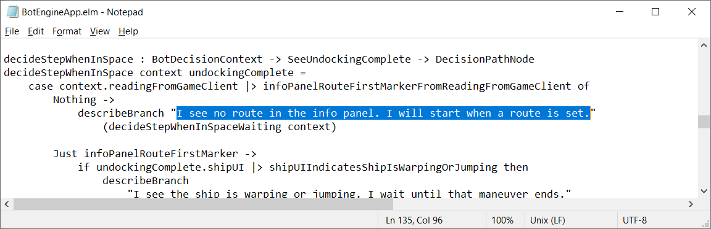
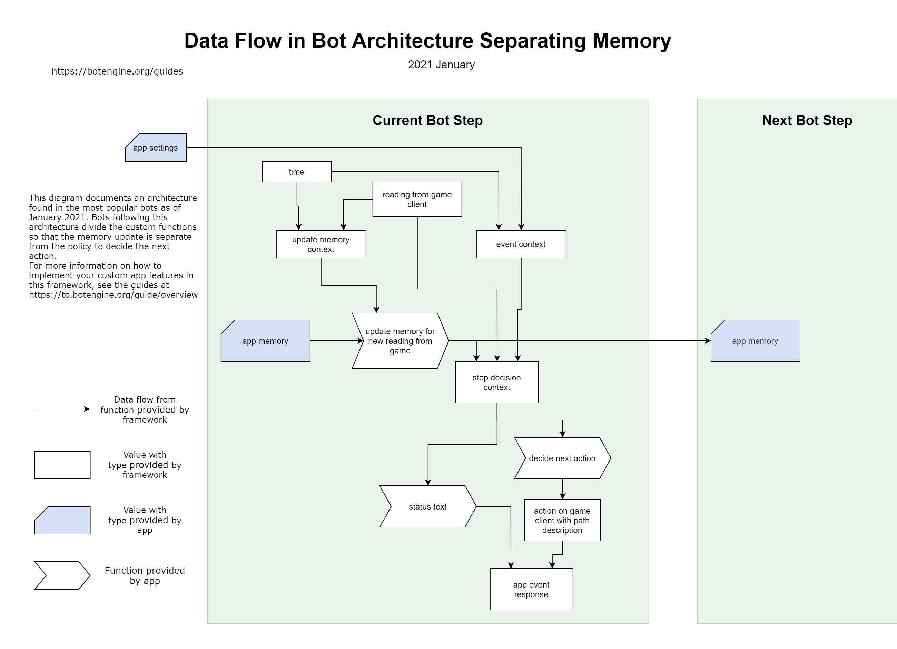
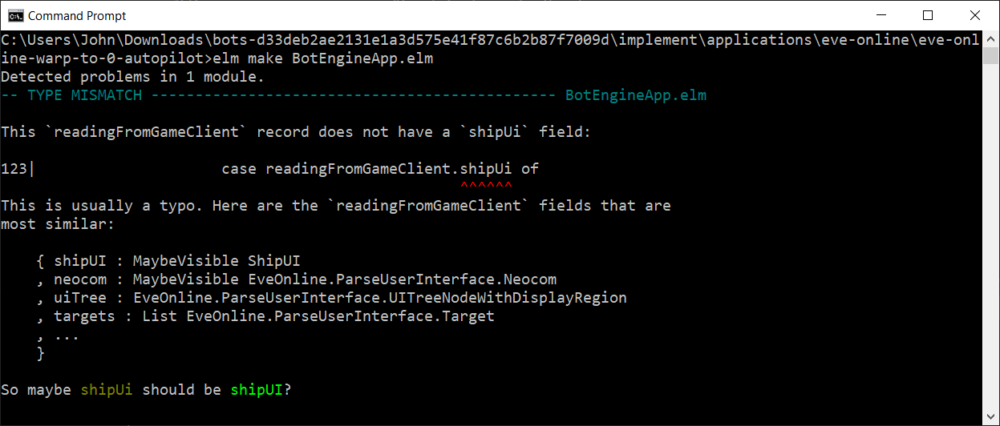
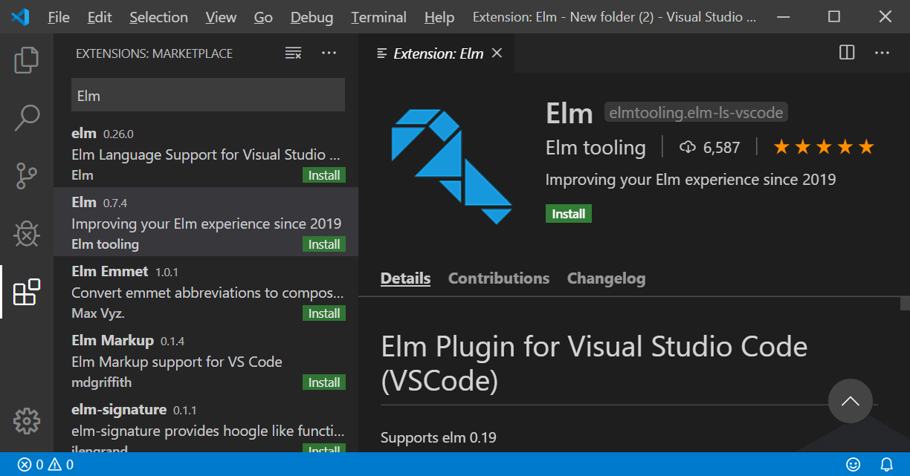
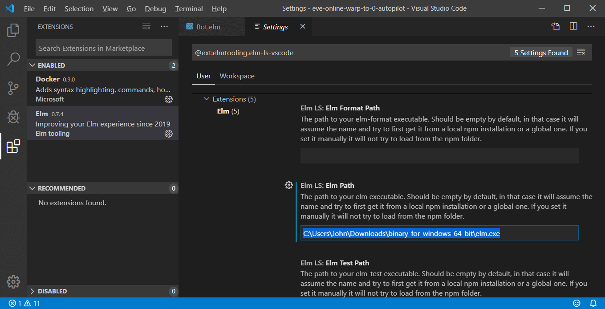
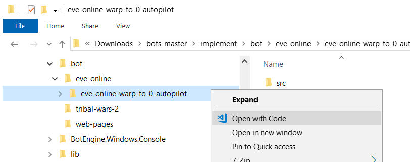
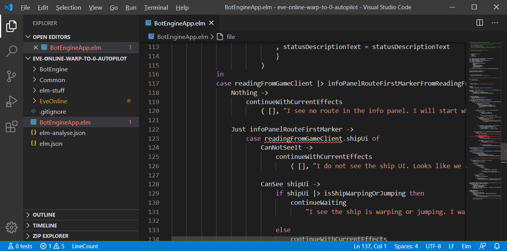
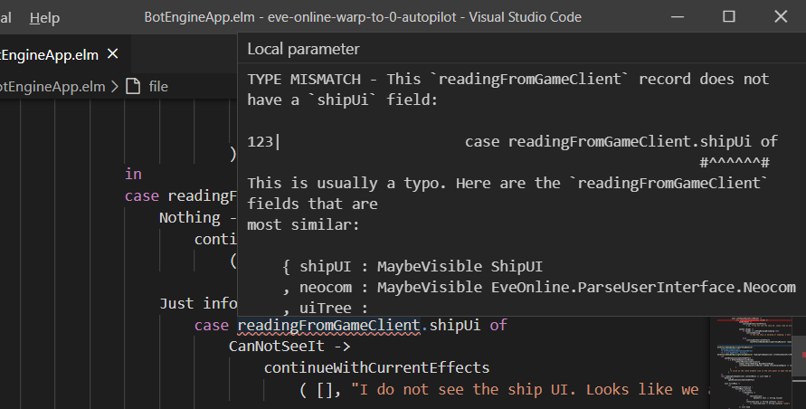
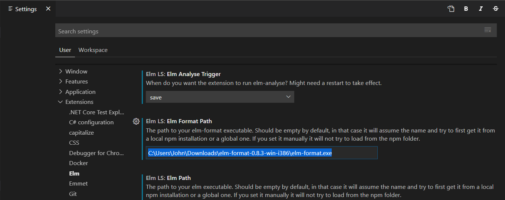

# Developing for EVE Online

Do you want to learn how to build a bot or intel tool for EVE Online or customize an existing one? This guide shows you how I make apps like these.

In part, this is a summary of my ~~failings~~ learnings from development projects. But most importantly, this guide lives from and evolves with your questions, so thank you for the feedback!

Wondering what outcome to expect? Two examples are the [mining bot](https://to.botengine.org/guide/app/eve-online-mining-bot) and [warp-to-0 autopilot](https://to.botengine.org/guide/app/eve-online-autopilot-bot).

## Comparing to Alternatives

The approach shown in this guide is just one out of many. How does it compare to, and how is it different from alternatives? I am not very patient with learning about all the details of underlying software or even hardware. To take the fastest route to a working app, I often build on libraries and tools that automate common tasks.
I select methods that are simple and easy to explain and lead to software with low maintenance costs. These qualities are more important to me than squeezing out the last percent of performance.

For those who already have some experience in software development, the following list details the technical choices that follow these preferences. If you have no programming experience, this list probably is less interesting, feel free to skip it:

+ I do not write into the game client's memory or use injection. These techniques can allow for more direct control of the game, which can bring some advantages. A downside of these methods is they enable CCP to detect the presence of the foreign program. Another reason I don't use injection is the more complex concept makes it harder to learn and maintain implementations. The approach to controlling the game client here is simulating mouse and keyboard input.

+ To get information about the game state and user interface, I use memory reading. Memory reading means reading directly from the memory of the game client process. So this guide does not cover the approach using image processing or 'OCR' on screenshots. The implementation of memory reading comes from the [Sanderling project](https://github.com/Arcitectus/Sanderling)

+ For a simple bot or macro, I could use a programming language like C# or Python. I use the Elm programming language because it is simpler to learn and works better for larger projects and makes collaboration easier. Especially the time-travel inspection and simulations are useful when working on bots.

+ Countless questions from other people taught me this: You want to make it easy for people to communicate what code they used and in which environment. If an app does not work as expected, understanding the cause requires not only having the program code but also knowing the scenario in which the app ran. The data an app reads from its environment is the basis for its decisions, so I favor methods that make it easy to collect, organize, and share it.

## The Simplest Custom App

In this section, we take the fastest way to a custom app.
First, let's look at one of the EVE Online apps in the example projects. Run this autopilot bot:

```cmd
botengine  run  "https://github.com/Viir/bots/tree/12f8a8ca4f79fbb14f47e79095cfc5ca5abb581e/implement/applications/eve-online/eve-online-warp-to-0-autopilot"
```

If the botengine program is not yet installed on your system, you need to install it first, as described in the guide at https://to.botengine.org/failed-run-did-not-find-botengine-program

The `botengine run` command loads the app code from the given address to run it on your system. Before running this app, you need to start an EVE Online client, no need to go beyond character selection.

When the bot has started, it will display this message:

> I see no route in the info panel. I will start when a route is set.

That is unless you have set a route in the autopilot.

To customize this bot, we change the app code. The app code is made up of the files behind the address we gave to the botengine program.
To edit the app code files, we download them first. Use this link to download all the files packaged in a zip-archive: https://github.com/Viir/bots/archive/12f8a8ca4f79fbb14f47e79095cfc5ca5abb581e.zip

Extract the downloaded zip-archive, and you will find the same subdirectory we used in the command to run the app: `implement\applications\eve-online\eve-online-warp-to-0-autopilot`.

Now you can use the `botengine  run` command on this directory as well:

```cmd
botengine  run  "C:\Users\John\Downloads\bots-12f8a8ca4f79fbb14f47e79095cfc5ca5abb581e\implement\applications\eve-online\eve-online-warp-to-0-autopilot"
```

Running this command gives you the same app with the same behavior because the app code files are still the same.

To change the app code, open the file `BotEngineApp.elm` in this directory in a text editor. For now, the Windows Notepad app is sufficient as an editor.

On [line 135](https://github.com/Viir/bots/blob/12f8a8ca4f79fbb14f47e79095cfc5ca5abb581e/implement/applications/eve-online/eve-online-warp-to-0-autopilot/BotEngineApp.elm#L135), you find the text that we saw in the bots status message earlier, enclosed in double-quotes:



Replace that text between the double-quotes with another text:

```Elm
    case context.readingFromGameClient |> infoPanelRouteFirstMarkerFromReadingFromGameClient of
        Nothing ->
            describeBranch "Hello World! - I see no route in the info panel. I will start when a route is set."
                (waitingInSpaceDecisionTree context)
```

When running the bot again from the local directory, you will see your change reflected in the status message in the console window.

### Getting Faster

Now you could generate random sequences of program text and test which ones are more useful. If you do this long enough, you will discover one that is more useful than anything anyone has ever found before.
But the number of possible combinations is too large to proceed in such a simple way. We need a way to discard the useless combinations faster.
In the remainder of this guide, I show how to speed up this process of discovering and identifying useful combinations.

## Observing and Inspecting an App

One way of observing an app is to watch the botengine window and the game client on a screen. That is what you see anyway when running a bot. The engine window displays the status text from the app and thus helps with the inspection.

But this mode of observing an app is limiting in two ways.

It is limiting because it requires us to process everything in real-time. But in most cases, information flows too fast for us to keep up. Things happen so quickly that we cannot even read all the status messages. We could pause the app to have more time to read, but that leads to other problems since every break distorts the app's perception of the environment.

The second limitation is the merely superficial representation we find in this mode. To understand how a bot works, we need to make visible more than just the status texts. When investigating an app's behavior, we want to follow the data-flow backward. Seeing the status text and the effects emitted by the app in response to an event is only the first step in this process.

While this simple way of observing is severely limiting, it can work. We can offset the incomplete observations with more experiments. Ten hours of tests could save us one hour of careful inspection.

But we don't have to make it so difficult for ourselves. These problems with observability are not new, and there are tools to help us overcome these limitations.

### DevTools and Time Travel

The first step to enable observability is to decouple the observation time from the app running time. Our development tools allow us to go back to any point in time and see everything as it was back then.

Let's see how this works in practice.
Before we can travel back in time, we need to run a botengine app (or get a session archive from somewhere else, as we will see later). You can use any of the example apps in the bots repository, miner, autopilot, or anomaly bot. When we run a bot, the engine saves a recording to disk by default.
After running an app, we can use the `botengine  devtools` command to open the development tools:


Running this command opens a web browser window. We continue in the web browser, no need to look at the console window anymore.


On that web page, we find a list of recent app-sessions, the last one at the top.

Clicking on one of the sessions' names brings us into the view of this particular session:


In the session view, we have a timeline of events in that session. Clicking on an event in the timeline opens the details for this event. The event details also contain the app's response to this event.


Besides the complete response, we also see the status text, which is part of the response but repeated in a dedicated section for better readability.

Some events inform the app about the completion of reading from the game client. For these events, the event details also show a visualization of the reading. For EVE Online, the common way to read from the game client is using memory reading. That is why we don't see a screenshot here, but a (limited) visualization.


This visualization shows the display regions of UI elements and some of the display texts. Using the button "Download reading as JSON file", we can export this memory reading for further examination. The inspection tools found in the alternate UI for EVE Online help us with that. You can find those tools at https://botengine.blob.core.windows.net/blob-library/by-name/2020-12-11-eve-online-alternate-ui.html
(To enable the Elm inspector ('debugger') tool for the alternate UI app itself, you can use the variant at https://botengine.blob.core.windows.net/blob-library/by-name/2020-12-11-eve-online-alternate-ui-with-inspector.html)

### Sharing Observations

To collaborate on the development of a bot, we often need to communicate scenarios, situations in which we want the bot to work. One way to describe such a scenario is to use the recording of an actual session as it happened. To export any session displayed in the DevTools, use the "Download session archive" button. This gets you a zip-archive that you can then share with other people. Now you can get help from other developers for your exact situation, no matter if the solution requires a change in program code or just different app-settings.

To import such a session archive in DevTools, use the `botengine  devtools` command with the path to the zip-archive as an additional argument:


When you start DevTools this way, the session from the specified path will show up at the top of the list of sessions in the DevTools UI:


## Overall App Code Structure and Data Flow

In 'The Simplest Custom App' section, we changed the code in the `BotEngineApp.elm` file to customize an app. Because we only made a simple change, we could do it without understanding the app code's overall structure. The more we want to change, the more we will benefit from understanding how everything works together.

This chapter explains the app code's overall structure and how data flows when the application runs.

To explore how a program works, we start from the part that you have already experience with: The observable behavior. From there, we work towards the parts which are invisible to the user, the implementation details.

On this journey, we will also pick up some basic vocabulary used in application development. Knowing the language will help you communicate with other developers and get help in case you need it.

### App Code Structure - Framework For EVE Online

To make development easier, we can use one of the frameworks available for EVE Online.
Using a framework is a tradeoff between flexibility and ease of use. You can compare it to using Microsoft Windows instead of building your custom operating system: Using this platform, we can avoid learning about lower levels of the software stack, like an assembly programming language.
In this guide, I use the most mainstream framework evolved from the works of some hundred EVE Online users and developers. When you look at the example apps, you will find that all kinds of bots use the same framework. It is flexible enough to cover activities like mining, ratting, trading, and mission running.
This framework's program code is included with the overall app program code in the subdirectory named `EveOnline`. This makes it easier to look up a definition of a framework function.
You can code all your customizations in the `BotEngineApp.elm` file. When you compare the files making up the example apps, you will find that the different bots only differ in the `BotEngineApp.elm` file. At the beginning of that code module, these apps import building blocks from other code modules of the framework, namely `EveOnline.AppFramework`, `EveOnline.AppFrameworkSeparatingMemory` and `EveOnline.ParseUserInterface`.
These three modules contain hundreds of building blocks to compose your app.

The structure of the app code follows the data flow. All data our app processes flows through the `initState` and `processEvent` functions in the `BotEngineApp.elm` file. Any other function is relevant only as far as it is somehow integrated into one of these two, directly or indirectly.

### Effects

For the application to be useful, it needs to affect its environment in some way eventually. If it is a bot, it might send input to the game client. An intel tool, on the other hand, might play a sound. We have a common name for these observable consequences of running the application: We call them 'effects'.

Following is a list of effects available in our framework:

+ Move the mouse cursor to a given location. (Relative to the game window (The client area of that window to be more specific))
+ Press a given mouse button.
+ Release a given mouse button.
+ Press a given keyboard key.
+ Release a given keyboard key.

These effects are not specific to EVE Online, which is why we use functions from the code module `Common.EffectOnWindow` to describe these effects.

### Events

To be able to decide which effects would be most useful, the application needs to learn about its environment. In our case, this environment is the game client. The application receives this information about the game client with events.

When programming an application, every effect originates from an event. An event can result in zero or multiple effects, but the application cannot issue an effect without an event. This constraint is not evident from a user's perspective because the user does not know when events happen. But knowing this rule helps to understand the structure of the program code.

In our framework for EVE Online, the events are simplified as follows: The only event that we customize is the arrival of a new reading from the game client. If we were using a more general framework, we had other kinds of events too. One example is when the user changes the app-settings, which can happen at any time. Our framework will not notify us every time the app-settings change. Instead, it forwards us the app-settings and other contextual information together with the next new reading from the game client. Another critical piece of context is the current time. The time too is forwarded only with the following new reading from the game client.

### Entry Point - `processEvent`

In the `BotEngineApp.elm` file of each app program code, you can find a declaration named [`processEvent`](https://github.com/Viir/bots/blob/12f8a8ca4f79fbb14f47e79095cfc5ca5abb581e/implement/applications/eve-online/eve-online-warp-to-0-autopilot/BotEngineApp.elm#L233-L241).

In contrast to other declarations in that file, `processEvent` has a unique role. This is a function that the botengine calls directly. All other declarations are only relevant for the program execution if integrated into `processEvent`. Because of its unique role, we also call it the 'entry point'.

The type of `processEvent` is not specific to EVE Online. Apps for other games use the same structure. Apps for the EVE Online client use the `EveOnline.AppFrameworkSeparatingMemory.processEvent` function to produce the more general `processEvent` function. We can see this in the example projects, no matter if the app is a mining bot, ratting bot, or just a monitor that watches local chat and alerts the user when a hostile pilot enters. 

Here is how the [autopilot example bot code](https://github.com/Viir/bots/blob/12f8a8ca4f79fbb14f47e79095cfc5ca5abb581e/implement/applications/eve-online/eve-online-warp-to-0-autopilot/BotEngineApp.elm#L233-L241) uses the framework function to configure the app:

```Elm
processEvent : InterfaceToHost.AppEvent -> State -> ( State, InterfaceToHost.AppResponse )
processEvent =
    EveOnline.AppFrameworkSeparatingMemory.processEvent
        { parseAppSettings = parseBotSettings
        , selectGameClientInstance = always EveOnline.AppFramework.selectGameClientInstanceWithTopmostWindow
        , updateMemoryForNewReadingFromGame = updateMemoryForNewReadingFromGame
        , decideNextStep = autopilotBotDecisionRoot
        , statusTextFromDecisionContext = statusTextFromDecisionContext
        }
```

In the snippet above, our app gives five functions to the framework to compose the app.

Using the `parseAppSettings` field, we configure how to parse the user's app settings string into a structured representation. The app-settings offer a way to customize app behavior without changing the app code. We can use any type we want for our app settings.

### Data Flow for a Bot Step

The framework structures the execution of our app as a series of 'bot steps'. Every time a new reading from the game client is complete, the framework performs one such bot step.

The information going into a bot step contains:

+ The reading from the game client.
+ The current time.
+ app-settings, structure as parsed earlier.
+ The planned session duration.

The result from a bot step contains:

+ Do we finish the session now, or do we continue? If we continue the session, what is the sequence of inputs we send to the game client?
+ The new status text to display to the user.

Of the five elements that we gave to the framework in the code snippet above, it uses the following three in each bot step:

+ `updateMemoryForNewReadingFromGame`: Here, we define anything we might need to remember in future bot steps. We use this memory to remember observations about the game world that we need to make decisions in the future: Which asteroid belts are already depleted? Which anomalies contains dangerous rats that we want to avoid? Another application of this memory is tracking performance statistics: How many rats have we killed in this session?

+ `decideNextStep`: Here, we decide how to proceed in the session: Do we continue or finish the session? If we continue, which inputs do we send to the game client?

+ `statusTextFromDecisionContext`: Here, we add to the status text displayed by the whole app. We expand this status text, for example, to show the performance metrics of our app.


The `decideNextStep` and `statusTextFromDecisionContext` run in parallel. They do not depend on each others output, but both depend on the return value from `updateMemoryForNewReadingFromGame`.

The diagram below visualizes the data flow for a single bot step:



The arrows in this diagram illustrate how the framework forwards data between the functions we supplied to compose the app.

### `parseAppSettings`

The framework invokes the `parseAppSettings` function every time the user changes the app-settings. The return type is a kind of `Result` which means we can decide that a given app-settings string is invalid and reject it. The `Err` case uses the `String` type, and we use this to explain to the user what exactly is wrong with the given app-settings string. You don't need to worry about how to generate these error messages, because there is already a framework for this. In our app, we only need to define a list of valid settings, and the framework will generate a precise error message if the user misspells the name of a setting or tries to use a setting with an unsupported value.


## Programming Language

The apps here are mainly written using the Elm programming language. Many apps also contain a small portion of glue code in other languages like C#, but thanks to the framework, you don't even need to read these low-level parts.

### An Introduction to Elm

A great resource to learn about the Elm programming language is the official guide at https://guide.elm-lang.org

Parts of this guide are specific to web applications and less interesting when building bots. However, it also teaches fundamentals, which are very useful for us, specifically ["Core Language"](https://guide.elm-lang.org/core_language.html) and ["Types"](https://guide.elm-lang.org/types/).
And if you want to get into even more detail: The [Appendix](https://guide.elm-lang.org/appendix/function_types.html) covers more advanced topics, helping to understand not only how to write apps, but also how the framework is built.

### Types

Types are an important tool we get with the programming language. The type system allows the engine to draw our attention to problems in the program code before we even run an app. In the program code of examples, you can find many descriptions of types on lines starting with the "type" keyword. Here are two examples:

```Elm
type alias DronesWindow =
    { uiNode : UITreeNodeWithDisplayRegion
    , droneGroups : List DronesWindowDroneGroup
    , droneGroupInBay : Maybe DronesWindowDroneGroup
    , droneGroupInLocalSpace : Maybe DronesWindowDroneGroup
    }
```

```Elm
type ShipManeuverType
    = ManeuverWarp
    | ManeuverJump
    | ManeuverOrbit
    | ManeuverApproach
```

The guide on the Elm programming language has a chapter ["Types"](https://guide.elm-lang.org/types/), and I recommend reading this to learn what these syntaxes mean. This chapter is also worth a look if you encounter a confusing "TYPE MISMATCH" error in a program code. In the ["Reading Types"](https://guide.elm-lang.org/types/reading_types.html) part, you will also find an interactive playground where you can test Elm syntax to reveal types that are sometimes not visible in program syntax.

Here is the link to the "Types" chapter in the Elm guide: https://guide.elm-lang.org/types/


## Setting up the Programming Tools

This section introduces a setup to help us:

+ Understand a program: Syntax highlighting helps with reading. Navigation becomes easier with the ability to jump to definitions and find references.
+ Check our app code for problems: Static analysis detects errors after typing and before running an app.

To achieve this, we combine the following tools:

+ Elm command line program
+ Visual Studio Code
+ elmtooling.elm-ls-vscode
+ elm-format

The following subsections explain in detail how to set up these tools.

To test and verify that the setup works, you need the source files of an app on your system. You can use the files from https://github.com/Viir/bots/blob/e1ed34842ab6ba6980684ae957c2c7d8b7e94903/implement/applications/eve-online/eve-online-warp-to-0-autopilot for this purpose.

### Elm command line program

The Elm command line program understands the [programming language](https://elm-lang.org/blog/the-perfect-bug-report) we use and [helps us](https://elm-lang.org/blog/compilers-as-assistants) find problems in the code we write.

You can download the Elm executable file from https://botengine.blob.core.windows.net/blob-library/by-name/elm.exe

Next, we perform a small test to verify the elm.exe program works on the app code as intended. Since `elm.exe` is a command line program, we start it from the Windows Command Prompt (cmd.exe).
Before starting the elm.exe, you need to navigate to the app code directory containing the `elm.json` file. You can use the `cd` command in the Command Prompt to switch to this directory, with a command like this:

```cmd
cd "C:\Users\John\Downloads\bots-39afeba4ca24884666a8e473a9d7ae6842ee6227\implement\applications\eve-online\eve-online-warp-to-0-autopilot"
```

Now you can use elm.exe on the app code files with a command like the following:
```
"C:\Users\John\Downloads\binary-for-windows-64-bit\elm.exe" make BotEngineApp.elm
```
If everything works so far, the elm.exe will write an output which ends like the following:
```
Success! Compiled 10 modules.
```
or just

```
Success!
```

That number of modules it mentions can vary;

To see the detection of errors in action, we can now make some destructive change to the `BotEngineApp.elm` file. For example, simulate a typing mistake, on [line 124](https://github.com/Viir/bots/blob/e1ed34842ab6ba6980684ae957c2c7d8b7e94903/implement/applications/eve-online/eve-online-warp-to-0-autopilot/BotEngineApp.elm#L124), replace `shipUI` with `shipUi`.
After saving the changed file, invoke Elm with the same command again. Now we get a different output, informing us about a problem in the code:


For development, we don't need to use the Elm program directly, but other tools depend on it. The tools we set up next automate the process of starting the Elm program and presenting the results inside a code editor.

### Visual Studio Code

Visual Studio Code is a software development tool from Microsoft, which also contains a code editor. This is not the same as 'Visual Studio', a commercial product from Microsoft. Visual Studio Code is free and open-source, and often abbreviated as 'VSCode' to better distinguish it from Visual Studio. To set it up, use the installer from https://code.visualstudio.com/download

### elmtooling.elm-ls-vscode

[elmtooling.elm-ls-vscode](https://marketplace.visualstudio.com/items?itemName=Elmtooling.elm-ls-vscode) is an extension for VSCode. It has multiple features to help with development in Elm programs such as our bots. An important one is the display of error messages inside the code editor. A more obvious feature is the syntax coloring in Elm files, as you will soon see.

To install this extension, open VSCode and open the 'Extensions' section (`Ctrl + Shift + X`).
Type 'elm' in the search box, and you will see the `Elm` extension as shown in the screenshot below:


Use the `Install` button to install this extension in VSCode.

Before this extension can work correctly, we need to tell it where to find the Elm program. Open the Visual Studio Code settings, using the menu entries `File` > `Preferences` > `Settings`.
In the settings interface, select the `Elm configuration` entry under `Extensions` in the tree on the left. Then you will see diverse settings for the elm extension on the right, as shown in the screenshot below. Scroll down to the `Elm Path` section and enter the file path to the elm.exe we downloaded earlier into the textbox. The screenshot below shows how this looks like:



VSCode automatically saves this setting and remembers it the next time you open the program.

To use VSCode with Elm, open it with the directory containing the `elm.json` file as the working directory. Otherwise, the Elm functionality will not work.
A convenient way to do this is using the Windows Explorer context menu entry `Open with Code` on the directory containing the code, as shown in the screenshot below:



Now we can test if our setup works correctly. In VSCode, open the `BotEngineApp.elm` file and make the same code change as done earlier to provoke an error message from Elm.
When you save the file (`Ctrl + S`), the VSCode extension starts Elm in the background to check the code. On the first time, it can take longer as required packages are downloaded. But usually, Elm should complete the check in a second. If the code is ok, you will not see any change. If there is a problem, this is displayed in multiple places, as you can see in the screenshot below:

+ In the file tree view, coloring files containing errors in red.
+ On the scroll bar in an open file. You can see this as a red dot in the screenshot. This indicator helps to scroll to interesting locations in large files quickly.
+ When the offending portion of the code is visible in an editor viewport, the error is pointed out with a red squiggly underline.



When you hover the mouse cursor over the highlighted text, a popup window shows more details. Here you find the message we get from Elm:



### elm-format

elm-format is a tool we use to format the text in the apps code files. This tool arranges program codes in a standard way - without changing the function. This consistent formatting makes the code easier to read. Using this standardized layout is especially useful when collaborating with other people or asking for help with coding.

The easiest way to use elm-format is by integrating it with VSCode, the same way as we did with the Elm command line program above.

You can download a zip-archive containing the executable program from https://github.com/avh4/elm-format/releases/download/0.8.3/elm-format-0.8.3-win-i386.zip
Extracting that zip-archive gets you the file `elm-format.exe`.

To integrate it with VSCode, navigate again to the `Elm LS` extension settings as we did for the other settings earlier. Here, enter the path to the `elm-format.exe` file in the text box under `Elm Format Path`, as shown in this image:



Now you can invoke the formatting using the `Format Document` command in the VSCode editor. An easy way to test if the formatting works is to open an `.elm` file from the example projects and add a blank line between two functions. As we can see in the example projects, the standard format is to have two empty lines between function definitions. When you add a third one in between, you can see it revert to two blank lines as soon as you invoke the formatting.

----

Any questions? The [BotEngine forum](https://forum.botengine.org) is the place to meet other developers and get help.
