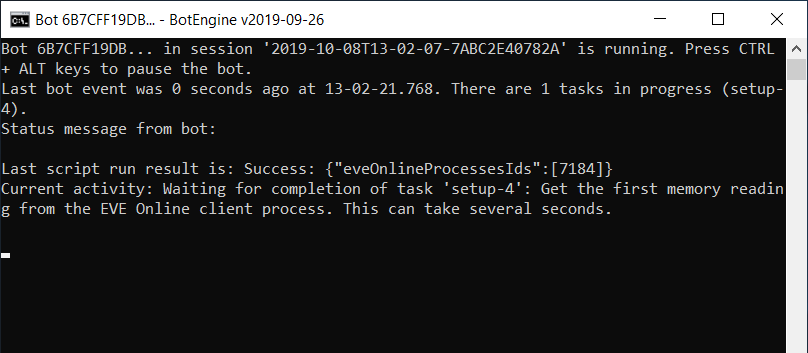

# EVE Online Anomaly Ratting Bot

This bot uses the probe scanner to warp to anomalies and kills rats using drones and weapon modules. 

## Features

+ **safe**: does not inject into or write to the EVE Online client. That is why using it with EVE Online is not detectable.
+ **accurate & robust**: This bot uses Sanderling memory reading to get information about the game state and user interface.

## Setting up the Game Client

Despite being quite robust, this bot is far from being as smart as a human. For example, its perception is more limited than ours, so we need to set up the game to make sure that the bot can see everything it needs to. Following is the list of setup instructions for the EVE Online client:

+ Set the UI language to English.
+ Enable the info panel 'System info'.
+ Undock, open probe scanner, overview window and drones window.
+ Set the Overview window to sort objects in space by distance with the nearest entry at the top.
+ In the ship UI, arrange the modules:
  + Place to use in combat (to activate on targets) in the top row.
  + Place modules that should always be active in the middle row.
  + Hide passive modules by disabling the check-box `Display Passive Modules`.
+ Configure the keyboard key 'W' to make the ship orbit.

## Starting the Ratting Bot

To start the bot, download the script from https://catalog.botengine.org/696f09be6825ba89f4e1e78973877a99d5803245c26f507d3839f04858c0574d and then run it.

In case the botengine program is not yet installed on your system, the script will redirect you to the installation guide at https://to.botengine.org/failed-run-bot-did-not-find-botengine-program

After completing the installation, run the script again to start the bot.

The bot needs a few seconds to start and find the EVE Online client process. It also shows status messages to inform what it is doing at the moment and when the startup is complete.

From here on, the bot works automatically. It detects the topmost game client window and starts working in that game client.

----

In case I forgot to add something here or you have any questions, don't hesitate to ask on the [BotEngine forum](https://forum.botengine.org/).

## Pricing and Online Sessions

You can test the bot for free. When you want the bot to run more than 15 minutes per session, use an online session as explained at [https://to.botengine.org/guide/online-session](https://to.botengine.org/guide/online-session)

Online sessions cost 2000 credits per hour. To add credits to your account, follow the instructions at [https://reactor.botengine.org/billing/add-credits](https://reactor.botengine.org/billing/add-credits)

For more about purchasing and using credits, see the guide at [https://forum.botengine.org/t/purchasing-and-using-botengine-credits-frequently-asked-questions-faq/837](https://forum.botengine.org/t/purchasing-and-using-botengine-credits-frequently-asked-questions-faq/837)

