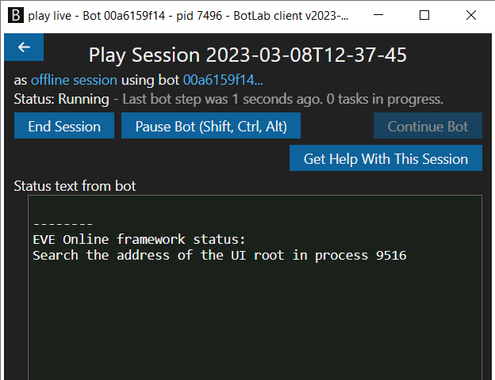

# EVE Online Combat Anomaly Bot

This bot uses the probe scanner to find combat anomalies and kills rats using drones and weapon modules.

## Features

+ Automatically detects if another pilot is in an anomaly on arrival and switches to another anomaly if necessary.
+ Filtering for specific anomalies using bot settings.
+ Avoiding dangerous or too-powerful rats using bot settings.
+ Remembers observed properties of anomalies, like other pilots or dangerous rats, to inform the selection of anomalies in the future.

## Setting up the Game Client

Despite being quite robust, this bot is less intelligent than a human. For example, its perception is more limited than ours, so we need to set up the game to ensure that the bot can see everything it needs. Following is the list of setup instructions for the EVE Online client:

+ Set the UI language to English.
+ Undock, open probe scanner, overview window and drones window.
+ In the ship UI, arrange the modules:
  + Place the modules to use in combat (to activate on targets) in the top row.
  + Hide passive modules by disabling the check-box `Display Passive Modules`.
+ Configure the keyboard key 'W' to make the ship orbit.

## Starting the Bot

If the BotLab client is not already installed on your machine, follow the guide at <https://to.botlab.org/guide/how-to-install-the-botlab-client>
The BotLab client is a tool for developing bots and also makes running bots easier with graphical user interfaces for configuration.

In the BotLab client, load the bot by entering the following link in the 'Select Bot' view:
<https://catalog.botlab.org/f698f8010ae995ef>

There is a detailed walkthrough video on how to load and run a bot at <https://to.botlab.org/guide/video/how-to-run-a-bot-live>

The bot needs a few seconds to start and find the EVE Online client process. It also shows status messages to inform what it is doing at the moment and when the startup is complete.



From here on, the bot works automatically. It detects the topmost game client window and starts working in that game client.

## Configuration Settings

All settings are optional; you only need them in case the defaults don't fit your use-case.

+ `anomaly-name` : Name of anomalies to select. Use this setting multiple times to select multiple names.
+ `hide-when-neutral-in-local` : Set this to 'yes' to make the bot dock in a station or structure when a neutral or hostile appears in the 'local' chat.
+ `avoid-rat` : Name of a rat to avoid by warping away. Enter the name as it appears in the overview. Use this setting multiple times to select multiple names.
+ `prioritize-rat` : Name of a rat to prioritize when locking targets. Enter the name as it appears in the overview. Use this setting multiple times to select multiple names.
+ `activate-module-always` : Text found in tooltips of ship modules that should always be active. For example: "shield hardener".
+ `anomaly-wait-time`: Minimum time to wait after arriving in an anomaly before considering it finished. Use this if you see anomalies in which rats arrive later than you arrive on grid.
+ `warp-to-anomaly-distance`: Defaults to 'Within 0 m'
+ `deactivate-module-on-warp` : Name of a module to deactivate when warping. Enter the name as it appears in the tooltip. Use this setting multiple times to select multiple modules.
+ `hide-location-name` : Name of a location to hide. Enter the name as it appears in the 'Locations' window.

When using more than one setting, start a new line for each setting in the text input field.
Here is an example of a complete settings string:

```
anomaly-name = Drone Patrol
anomaly-name = Drone Horde
hide-when-neutral-in-local = yes
avoid-rat = Infested Carrier
activate-module-always = shield hardener
hide-location-name = Dock me here
```

----

In case I forgot to add something here or you have any questions, don't hesitate to ask on the [BotLab forum](https://forum.botlab.org/).

## Pricing and Online Sessions

You can test the bot for free. When you want the bot to run more than 15 minutes per session, use an online session as explained at <https://to.botlab.org/guide/online-session>

Online sessions cost 2000 credits per hour. To add credits to your account, follow the instructions at <https://reactor.botlab.org/billing/add-credits>

For more about purchasing and using credits, see the guide at <https://forum.botlab.org/t/purchasing-and-using-botlab-credits-frequently-asked-questions-faq/837>

## Running Multiple Instances

This bot supports running multiple instances on the same desktop. In such a scenario, the individual bot instances take turns sending input and coordinate to avoid interfering with each other's input. To learn more about multi-instance setup, see <https://to.botlab.org/guide/running-bots-on-multiple-game-clients>

