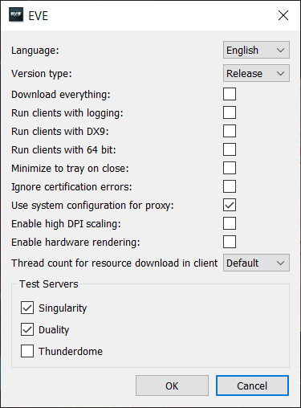

# How to Automate Traveling in EVE Online - Using a Warp-To-0 Autopilot

When playing EVE Online, you might spend significant time traveling between solar systems. This activity is so common that there is even an in-game autopilot to automate this process. But that autopilot has a critical flaw: It is quite inefficient and will cause long travel times. You can travel faster by manually commanding your ship.

Fortunately, this process can be automated using a bot. The bot we are using here follows the route set in the in-game autopilot and uses the context menu to initiate warp and dock commands. Using the following steps, you can set up your warp-to-0 auto-pilot bot, to travel fast and safe in EVE Online.

+ Download the BotEngine console from the following address:
[https://botengine.blob.core.windows.net/blob-library/by-name/2019-12-11.BotEngine.Console.zip](https://botengine.blob.core.windows.net/blob-library/by-name/2019-12-11.BotEngine.Console.zip). Extract this Zip-Archive. This will give you a file named `BotEngine.exe`.
+ The bot we will use in this guide only works when the EVE Online client is configured to not run in 64-bit mode. Make sure that the setting `Run clients with 64 bit` is *disabled* for the EVE Online client. You can check this in the settings dialog shown in the screenshot below:


+ Start the EVE Online client and log in to the game.
+ To start the autopilot bot, run the `BotEngine.exe` program with the following command:

```cmd
C:\path\to\the\BotEngine.exe  run-bot  --bot-source="https://github.com/Viir/bots/tree/cba8167a7b02120315b1adb2d7c697f29b95c09b/implement/applications/eve-online/eve-online-warp-to-0-autopilot"
```
You can enter this command in the Windows app called ['Command Prompt' (cmd.exe)](https://en.wikipedia.org/wiki/Cmd.exe). This app comes by default with any Windows 10 installation.

After you have entered this command, the bot needs a few seconds to start and find the EVE Online client process. It also shows status messages to inform what it is doing at the moment and when the startup is complete.


When the startup sequence has completed, the bot might display this message:

> I see no route in the info panel. I will start when a route is set.

We need to set the destination in the in-game autopilot so that the route is visible in the `Route` info panel. But we do not start the in-game autopilot because it would interfere with our bot.
Also, this bot does not undock, so we need to undock our ship manually for the bot to start piloting. As long as the ship is docked, the bot displays the following message:

> I cannot see if the ship is warping or jumping. I wait for the ship UI to appear on the screen.

As soon as we undock, the bot will start to send mouse clicks to the game client to initiate warp and jump maneuvers.

Alright, I think that is all there is to know about the basic autopilot bot. If you have questions about this bot or are searching for other bots, don't hesitate to ask on the [BotEngine forum](https://forum.botengine.org/).

(This guide is based on the more general guide at [/guide/how-to-run-a-bot.md](./../how-to-run-a-bot.md))
