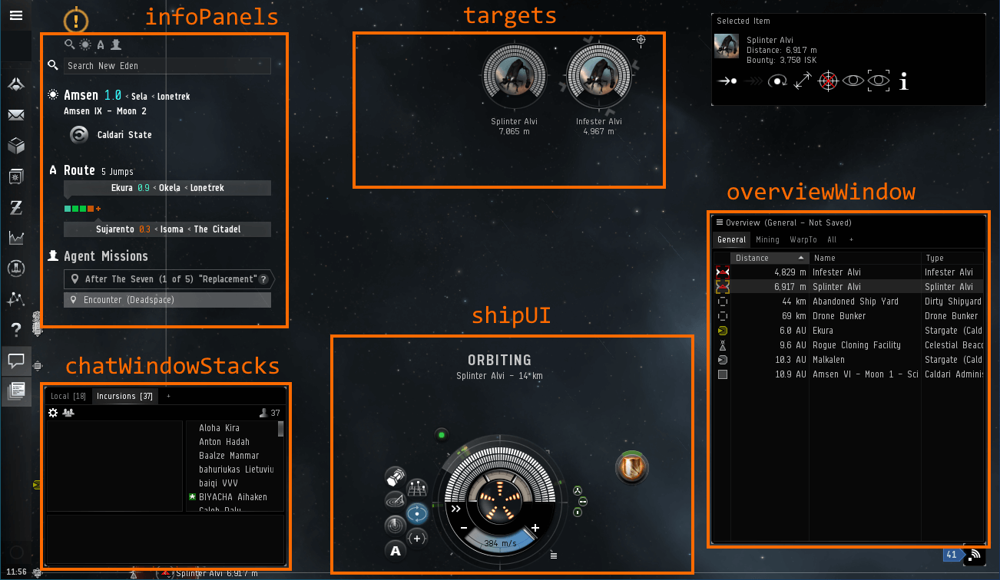
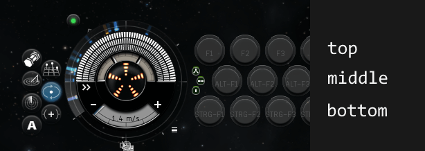
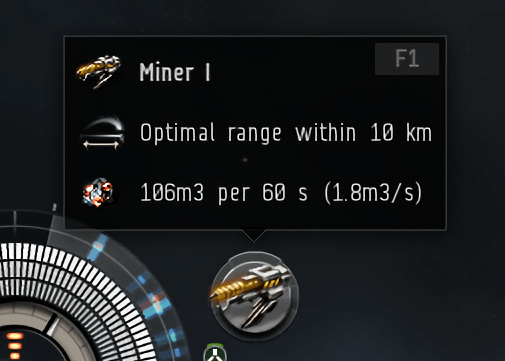
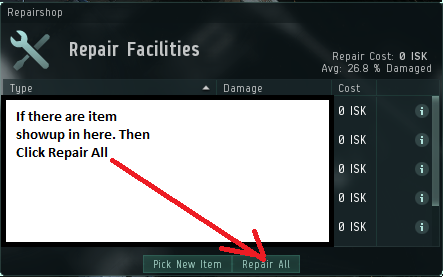

# Parsed User Interface of the EVE Online Game Client

The parsed user interface is a library of building blocks to build apps that read from the EVE Online game client.

### Functions

The EVE Online client's UI tree can contain thousands of nodes and tens of thousands of individual properties. Because of this large amount of data, navigating in there can be time-consuming.

When programming an app, we use functions to reach into the UI tree and extract the parts needed for our app. Sometimes the information we need is buried somewhere deep in the tree, contained in other nodes with redundant data. The structure we find in the UI tree is what CCP uses to build a visual representation of the game. It is not designed to be easily accessible to us, so it is not surprising to find many things there that we don't need for our applications and want to filter out.

### Types

To find things faster and automatically detect program code errors, we also use types adapted to the user interface's shape. We use the type system of the Elm programming language to assign names to parts of the UI tree describe the values that we expect in certain parts of the UI. The types provide us with names more closely related to players' experience, such as the overview window or ship modules.

To help find these functions and types, we collect the most popular ones in the [`EveOnline.ParseUserInterface`](https://github.com/Viir/bots/blob/64651b4700c6c23fb8c38b4988ddcc91c689b559/implement/applications/eve-online/eve-online-mining-bot/EveOnline/ParseUserInterface.elm) Elm module.

If you are not sure how to read the type definitions in that module, see the ["Reading Types"](https://guide.elm-lang.org/types/reading_types.html) and ["Type Aliases"](https://guide.elm-lang.org/types/type_aliases.html) sections in the Elm programming language guide.

When you use the alternate UI or one of the example apps in the bots repository, you will find these already integrate the parsing framework. These apps apply the `parseUserInterfaceFromUITree` function to parse the complete user interface. The return type of that function represents the whole user interface:

```Elm
type alias ParsedUserInterface =
    { uiTree : UITreeNodeWithDisplayRegion
    , contextMenus : List ContextMenu
    , shipUI : Maybe ShipUI
    , targets : List Target
    , infoPanelContainer : Maybe InfoPanelContainer
    , overviewWindow : Maybe OverviewWindow
    , selectedItemWindow : Maybe SelectedItemWindow
    , dronesWindow : Maybe DronesWindow
    , fittingWindow : Maybe FittingWindow
    , probeScannerWindow : Maybe ProbeScannerWindow
    , directionalScannerWindow : Maybe DirectionalScannerWindow
    , stationWindow : Maybe StationWindow
    , inventoryWindows : List InventoryWindow
    , chatWindowStacks : List ChatWindowStack
    , agentConversationWindows : List AgentConversationWindow
    , marketOrdersWindow : Maybe MarketOrdersWindow
    , surveyScanWindow : Maybe SurveyScanWindow
    , bookmarkLocationWindow : Maybe BookmarkLocationWindow
    , repairShopWindow : Maybe RepairShopWindow
    , moduleButtonTooltip : Maybe ModuleButtonTooltip
    , neocom : Maybe Neocom
    , messageBoxes : List MessageBox
    , layerAbovemain : Maybe UITreeNodeWithDisplayRegion
    }
```

As we can see in the definition of this record type above, its fields integrate many other types found in this module.

Below you find some of those types copied combined with a screenshot of the corresponding portion in the user interface.

Of all the fields, the `uiTree` field is a bit special. This field links to the raw UI tree that went into the `parseUserInterfaceFromUITree` function. All the other fields contain derivations of the UI tree for easier access.

In case the field names aren't clear, this annotated screenshot of the game client illustrates what is what, for some of the more popular elements:



## Ship UI

```Elm
type alias ShipUI =
    { uiNode : UITreeNodeWithDisplayRegion
    , capacitor : ShipUICapacitor
    , hitpointsPercent : Hitpoints
    , indication : Maybe ShipUIIndication
    , moduleButtons : List ShipUIModuleButton
    , moduleButtonsRows :
        { top : List ShipUIModuleButton
        , middle : List ShipUIModuleButton
        , bottom : List ShipUIModuleButton
        }
    , offensiveBuffButtonNames : List String
    , squadronsUI : Maybe SquadronsUI
    }
```

### Capacitor

```Elm
type alias ShipUICapacitor =
    { uiNode : UITreeNodeWithDisplayRegion
    , pmarks : List ShipUICapacitorPmark
    , levelFromPmarksPercent : Maybe Int
    }
```

Use the field `levelFromPmarksPercent` to get the capacitor level in percent.

### Module Buttons

```Elm
type alias ShipUIModuleButton =
    { uiNode : UITreeNodeWithDisplayRegion
    , slotUINode : UITreeNodeWithDisplayRegion
    , isActive : Maybe Bool
    , isHiliteVisible : Bool
    , rampRotationMilli : Maybe Int
    }
```

The ship UI displays ship modules in the form of module buttons. One module button can represent a single module or multiple grouped modules. We can look at these module buttons to learn about the state of the modules, and we can also click on them to toggle the module activity.

Some apps identify ship modules by their display location because this is faster than reading the tooltips. You can find some app descriptions calling for arranging modules into the three rows by use. To access the modules grouped into `top`, `middle`, and `bottom`, use the field `moduleButtonsRows`.



## Module Button Tooltip



```Elm
type alias ModuleButtonTooltip =
    { uiNode : UITreeNodeWithDisplayRegion
    , shortcut : Maybe { text : String, parseResult : Result String (List Common.EffectOnWindow.VirtualKeyCode) }
    , optimalRange : Maybe { asString : String, inMeters : Result String Int }
    }
```

The module button tooltip helps us to learn more about the module buttons displayed in the ship UI. This UI element appears when we move the mouse over a module button and shows details of the ship module(s) it represents.

Use the function `getAllContainedDisplayTexts` to get the texts contained in the tooltip.

Besides information about the modules, the tooltip also shows the keyboard shortcut to toggle the activity of the module(s). The framework parses these into representations of the keyboard keys. You can use this list of keys to toggle modules without using the mouse.

### Linking a Tooltip With Its Module Button

For the module button tooltip to be useful, we usually want to know which module button it belongs to. The easiest way to establish this link is by using the `isHiliteVisible` field on the module button: When you move the mouse over a module button to trigger the tooltip, you can see `isHiliteVisible` switches to `True` for the module button. Apps use this approach and then remember the tooltip for each module button. There are common functions to update a memory structure holding this information, most importantly `integrateCurrentReadingsIntoShipModulesMemory` in the mining bot example.

## Inventory Window

To work with items in the inventory, use the property `selectedContainerInventory` in the inventory window. In the property `itemsView`, you get this list of items visible in the selected container:


Are looking for an item with a specific name? You could use the filtering function in the game client, but there is an easier way: Using the function `getAllContainedDisplayTexts` on the inventory item, you can filter the list of items immediately.

As you can also see in the screenshot of the live inspector, we get the used, selected, and maximum capacity of the selected container with the property `selectedContainerCapacityGauge`. You can compare the `used` and `maximum` values to see if the container is (almost) full. The [mining bot does this](https://github.com/Viir/bots/blob/64651b4700c6c23fb8c38b4988ddcc91c689b559/implement/applications/eve-online/eve-online-mining-bot/BotEngineApp.elm#L1107-L1112) on the ore hold to know when to travel to the unload location.

## Repairshop Window

In the 'Repairshop'/'Repair Facilities' window, you can repair your ship.

```Elm
type alias RepairShopWindow =
    { uiNode : UITreeNodeWithDisplayRegion
    , items : List UITreeNodeWithDisplayRegion
    , repairItemButton : Maybe UITreeNodeWithDisplayRegion
    , pickNewItemButton : Maybe UITreeNodeWithDisplayRegion
    , repairAllButton : Maybe UITreeNodeWithDisplayRegion
    }
```



