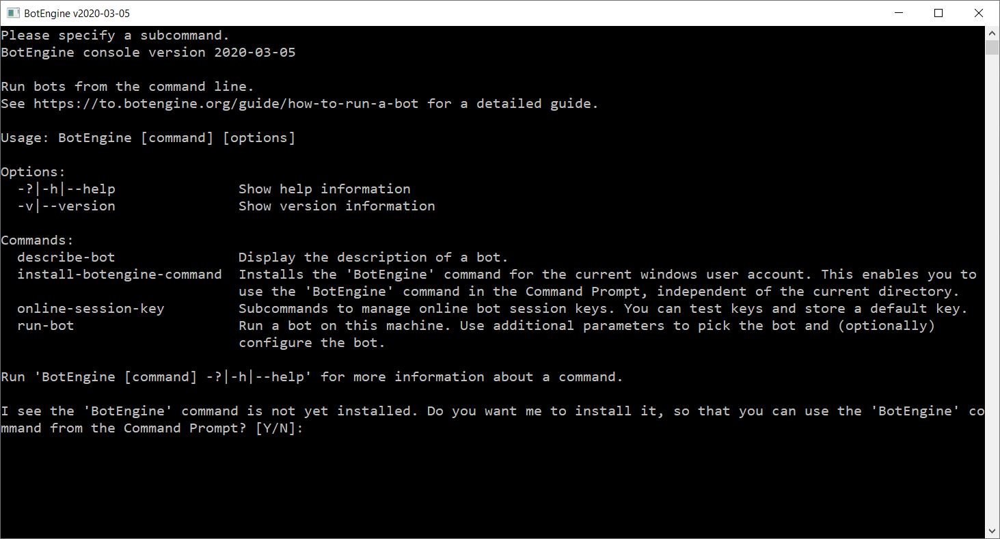

# Failed to Run App - Did Not Find the BotEngine Program

When you land here, you probably tried to use the `botengine` program in some form. Maybe you downloaded a script from the [botengine catalog](https://to.botengine.org/catalog), and got this error message when running the script:

> I failed to run the app because I did not find the 'botengine.exe' program.

Or maybe you tried following instructions to run a command in the Windows Command Prompt and got an error message like this:

> 'botengine' is not recognized as an internal or external command,
operable program or batch file.

The botengine program is a tool for developing and running bots, and many guides implicitly assume it is registered on your Windows system. To make these guides and scripts work, follow these steps:

+ Download the file from 
[https://botengine.blob.core.windows.net/blob-library/by-name/2020-08-24-botengine-console.zip](https://botengine.blob.core.windows.net/blob-library/by-name/2020-08-24-botengine-console.zip).
+ Extract the downloaded zip-archive. The extraction will give you a file named `BotEngine.exe`.
+ Run the `BotEngine.exe` program. It will open a window like in this screenshot:
  
  At the bottom, we find this text:
  > I see the 'BotEngine' command is not yet installed. Do you want me to install it, so that you can use the 'BotEngine' command from the Command Prompt? [Y/N]:
+ To start the installation/registration, press the `y` key and then the `Enter` key in this Window.
+ The program then confirms the successful installation with a new output like this:
  > I added the path 'C:\Users\John\Downloads\2020-08-24-botengine-console' to the 'PATH' environment variable for the current Windows user account. You will be able to use the 'BotEngine' command in newer instances of the Command Prompt.

That's it; the installation is complete. Now you can use the `botengine` command in the Windows Command Prompt in any directory. Note that this will not work in Command Prompt windows that were already open before. Open a new window to use the newly registered program.

If you have any questions, the [BotEngine forum](https://forum.botengine.org) is a good place to learn more.
