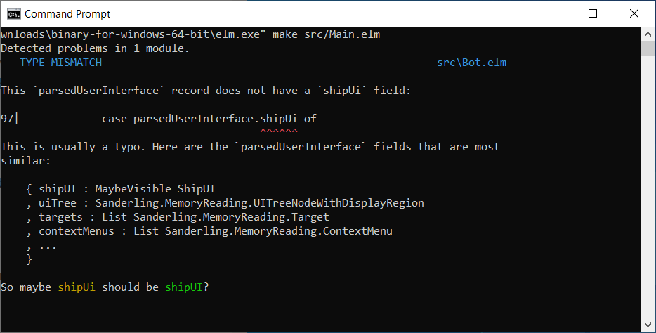
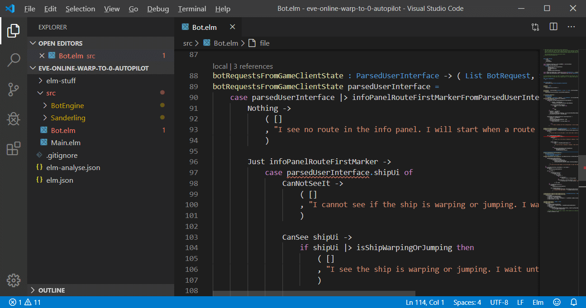
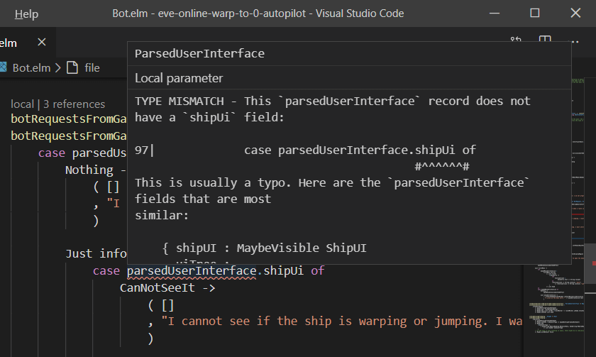

# How to Develop EVE Online Bots

This is a guide for beginners on how to develop EVE Online bots. You don't need prior experience in programming or software development, as I explain the process and tools from the ground up.
There is a separate guide on how to run EVE Online bots, read that first, as this guide assumes you already know how to load, start, configure, and operate a bot. You can find that guide at [./how-to-run-a-bot.md](./how-to-run-a-bot.md).

This guide goes beyond just running and configuring bots. The tools I show here give you the power to automate anything in EVE Online. I will also summarize what I learned during bot development projects like the EVE Online mission running and anomaly ratting bots, or the Tribal Wars 2 farmbot. The goal is to present the methods and approaches which make the development process efficient and a pleasant experience.

## Development Process

Bot development begins by identifying a situation in which the bot should act. The same applies if we want to add new functionality to or fix a problem in a bot: In both cases, we observe a situation in which the bot acted differently than it should.

Because the bot perceives the game world trough screenshots, we use screenshots to describe this situation.

In simple cases, the most recent screenshot is sufficient to decide what to do in the game. In other cases, the bot needs to account for information which is not visible in the last screenshot but was visible in an earlier screenshot. In this case, we use a sequence of screenshots to describe the situation.

After describing a situation the bot could encounter, the next development step is to explain how it should act in this situation. A bot can act by sending mouse movements, mouse clicks, and keyboard key presses to the game client.

## Bot Architecture

Before we look at any code, let me give you a high-level overview of how a bot works and how it is structured.

A bot is a program which reacts to events. Every time an event happens, the engine tells the bot. Given this information, the bot then computes its new state and a response to this event.

This event response is given to the engine and contains the following two components:

+ A status message to inform about the current state in a human-readable form. When you run a bot, you can see the engine displaying this message.
+ A list of tasks for the engine to execute.

This event/response cycle repeats for every event happening during the operation of the bot.

Some examples of events:

+ The user sets the bot configuration (as explained in the [guide on how to run a bot](./how-to-run-a-bot.md#configuring-a-bot)).
+ The engine completes executing one of the tasks it received from the bot in an earlier cycle. The event contains the result of the execution of this task.

Examples of tasks the bot can give to the engine:

+ Take a screenshot of a window of another app on the system.
+ Read the contents of another process' memory.
+ Send a mouse click to a specific position in a window in another process.
+ Simulate pressing a keyboard key.
+ Start a new Windows process, specifying the path to an executable file.
+ Stop another process on the system.

As we can see from the examples above, these events and tasks can be quite fine-grained, so you might see the event/response cycle happen several times per second.

## Bot Code

### File Structure

The bot code is a set of files. Some of these files are located in subdirectories. The bot code contains the following files:

+ `src/Bot.elm`: When you code a bot from scratch, this file is where you start to edit.
+ `src/Interface_To_Host_20190808.elm`: You don't need to edit anything in here.
+ `elm.json`. This file is only edited to include Elm packages (That is a way to include functionality from external sources).

You can distribute code into more `.elm` files. But this is not required, you can add everything to the `src/Bot.elm` file.

Each file with a name ending in `.elm` contains one [Elm module](https://guide.elm-lang.org/webapps/modules.html). Each module contains [functions](https://guide.elm-lang.org/core_language.html), which are composed to describe the behavior of the bot.

### Entry Point - `processEvent`

Each time an event happens, the framework calls the function `interfaceToHost_processEvent` from the `Main.elm` file. Because of this unique role, this function is sometimes also referred to as 'entry point'.

Let's look at how this function is implemented. Usually it will look like this:
```Elm
interfaceToHost_processEvent : String -> InterfaceBotState -> ( InterfaceBotState, String )
interfaceToHost_processEvent =
    InterfaceToHost.wrapForSerialInterface_processEvent processEvent
```
This function takes care of serializing and deserializing on the interface to the engine, and delegates everything else to the `processEvent` function in the same file. It translates between the serial representations used on the interface and typed values, so that we can enjoy the benefits of the type system when working on the bot code. In theory, this function could look different, because you could rename the function `processEvent` to something else. But we will leave this function alone, forget about it and turn to the `processEvent` function.

Let's look at the type signature of `processEvent`, the first line of the functions source code:
```Elm
processEvent : InterfaceToHost.BotEvent -> State -> ( State, InterfaceToHost.BotResponse )
```
Thanks to the translation in the wrapping function discussed above, the types here are already more specific. So this type signature better tells what kinds of values this function takes and returns.

> The actual names for the types used here are only conventions. You might find a bot code which uses different names. For example, the bot author might choose to abbreviate `InterfaceToHost.BotEvent` to `BotEvent`, by using a type alias.

I will quickly break down the Elm syntax here: The part after the last arrow (`->`) is the return type. It is a tuple with two components. The part between the colon (`:`) and the return type is the list of parameters. So we have two parameters, one of type `InterfaceToHost.BotEvent` and one of type `State`.

Let's have a closer look at the three different types here:

+ `InterfaceToHost.BotEvent`: This describes an event that happens during the operation of the bot. All information the bot ever receives is coming through the values given with this first parameter.
+ `InterfaceToHost.BotResponse`: This type describes what the engine should do.
+ `State`: The `State` type is specific to the bot. With this type, we describe what the bot remembers between events. When the engine informs the bot about a new event, it also passes the `State` value which the bot returned after processing the previous event (The first component of the tuple in the return type). But what if this is the first event? Then there is no previous event? In this case, the engine takes the value from the function `interfaceToHost_initState` to give to the bot.

## Setting up the Programming Tools

The goal of this section is to enable you to edit a bot and quickly find possible problems in the code.
To achieve this, we combine the following tools:

+ Elm command line program
+ Visual Studio Code
+ elmtooling.elm-ls-vscode

The following subsections explain in detail how to set up these tools.

To test and verify that the setup works, you need the source files of a bot on your system. You can use the files from https://github.com/Viir/bots/tree/8a81fc6190e6053abaa2b9941e5c1b8365dba644/implement/applications/eve-online/eve-online-warp-to-0-autopilot for this purpose.

### Elm command line program

The Elm command line program understands the [programming language](https://elm-lang.org/blog/the-perfect-bug-report) we use and [helps us](https://elm-lang.org/blog/compilers-as-assistants) find problems in the code we write.

Download the file from https://github.com/elm/compiler/releases/download/0.19.1/binary-for-windows-64-bit.gz

Extract the `binary-for-windows-64-bit.gz` file; this will get you a file named `binary-for-windows-64-bit`. Rename this to `elm.exe`, so the system will recognize it as an executable file. If you don't know how to extract `.gz` files, [7zip](https://www.7-zip.org) can do that.

Next, we perform a small test to verify the elm.exe program works on the bot code as intended. Since `elm.exe` is a command line program, we start it from the Windows Command Prompt (cmd.exe).
Before starting the elm.exe, you need to navigate to the bot code directory containing the `elm.json` file. You can use the `cd` command in the Command Prompt to switch to this directory, with a command like this:
```cmd
cd "C:\Users\John\Downloads\bots\implement\applications\bot\eve-online\eve-online-warp-to-0-autopilot"
```

Now you can use elm.exe on the bot code files with a command like the following:
```
"C:\Users\John\Downloads\binary-for-windows-64-bit\elm.exe" make src/Main.elm
```
If everything works so far, the elm.exe will write an output which ends like the following:
```
Success! Compiled 1 module.

    Main ---> index.html
```
That number of modules it mentions can vary;

To see the detection of errors in action, we can now make some destructive change to the `Bot.elm` file. For example, simulate a typing mistake, on [line 97](https://github.com/Viir/bots/blob/8a81fc6190e6053abaa2b9941e5c1b8365dba644/implement/applications/eve-online/eve-online-warp-to-0-autopilot/src/Bot.elm#L97), replace `shipUI` with `shipUi`.
If after this change we invoke Elm with the same command again, we now get a different output, informing us about a problem in the code:


For development, we don't need to use the Elm program directly, but other tools depend on it. The tools we set up next automate the process of starting the Elm program and presenting the results inside a code editor.

### Visual Studio Code

Visual Studio Code is a software development tool from Microsoft, which also contains a code editor. This is not the same as 'Visual Studio', a commercial product from Microsoft. Visual Studio Code is abbreviated as 'VSCode' throughout this guide. To set it up, use the installer from https://code.visualstudio.com/download

### elmtooling.elm-ls-vscode

[elmtooling.elm-ls-vscode](https://marketplace.visualstudio.com/items?itemName=Elmtooling.elm-ls-vscode) is an extension for VSCode. It has multiple features to help with development in Elm programs such as our bots. An important one is the display of error messages inside the code editor. A more obvious feature is the syntax coloring in Elm files, as you will soon see.

To install this extension, open VSCode and open the 'Extensions' section (`Ctrl + Shift + X`).
Type 'elm' in the search box, and you will see the `Elm` extension as shown in the screenshot below:


Use the `Install` button to install this extension in VSCode.

Before this extension can work correctly, we need to tell it where to find the Elm program. Open the Visual Studio Code settings, using the menu entries `File` > `Preferences` > `Settings`.
In the settings interface, select the `Elm configuration` entry under `Extensions` in the tree on the left. Then you will see diverse settings for the elm extension on the right, as shown in the screenshot below. Scroll down to the `Elm Path` section and enter the file path to the elm.exe we downloaded earlier into the textbox. The screenshot below shows how this looks like:


VSCode automatically saves this setting and remembers it the next time you open the program.

To use VSCode with Elm, open it with the directory containing the `elm.json` file as the working directory. Otherwise, the Elm functionality will not work.
A convenient way to do this is using the Windows Explorer context menu entry `Open with Code` on the bot directory, as shown in the screenshot below:


Now we can test if our setup works correctly. In VSCode, open the `Bot.elm` file and make the same code change as done earlier to provoke an error message from Elm.
When you save the file (`Ctrl + S`), the VSCode extension starts Elm in the background to check the code. On the first time, it can take longer as required packages are downloaded. But usually, Elm should complete the check in a second. If the code is ok, you will not see any change. If there is a problem, this is displayed in multiple places, as you can see in the screenshot below:

+ In the file tree view, coloring files containing errors in red.
+ On the scroll bar in an open file. You can see this as a red dot in the screenshot. This indicator helps to scroll to interesting locations in large files quickly.
+ When the offending portion of the code is visible in an editor viewport, the error is pointed out with a red squiggly underline.



When you hover the mouse cursor over the highlighted text, a popup window shows more details. Here you find the message we get from Elm:



## Programming Language

#### Custom Types

Custom types are also called tagged union types or algebraic data types. In the documentation about Elm, the term 'Custom Type' seems to be more popular.

Let's look at how a custom type with a type parameter can be used to compose more specific types. I will take a popular example of such a type. This one is often used to describe what can be seen on the screen.

```Elm
type MaybeVisible feature
    = CanNotSeeIt
    | CanSee feature
```

In this type definition, we have a type parameter called `feature`. We can instantiate the `MaybeVisible` type by specifying what to use as `feature`. For example, we can use the type `Bool` as the `feature`:

```Elm
type alias MaybeVisibleBool =
    MaybeVisible Bool
```

The type `MaybeVisible Bool` can have three different values:

+ `CanNotSeeIt`
+ `CanSee True`
+ `CanSee False`

In the larger context, this combination could be used as follows:
```Elm
type alias EveOnlineVision =
    { shipOreHoldIsFull : MaybeVisible Bool
    }


describeWhatWeSee : EveOnlineVision -> String
describeWhatWeSee vision =
    case vision.shipOreHoldIsFull of
        CanNotSeeIt ->
            "I can not see if the ships ore hold is full. Do we need to change the setup?"

        CanSee True ->
            "The ships ore hold is full."

        CanSee False ->
            "The ships ore hold is not full."
```

----

Any questions? The [BotEngine forum](https://forum.botengine.org) is the place to meet other developers and get help.
