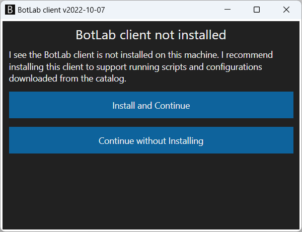
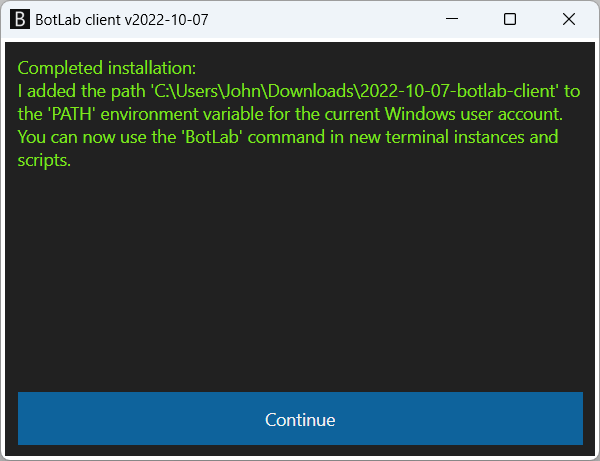

# How to Install the BotLab Client and Register the `botlab` Command

When you land here, you might have tried to use the `botlab` program in some form. Maybe you downloaded a script from the [bot catalog](https://to.botlab.org/catalog), and got this error message when running the script:

> I failed to run the bot because I did not find the 'botlab.exe' program.

Or maybe you followed instructions to run a command in Windows and got an error message like this:

> 'botlab' is not recognized as an internal or external command,
operable program or batch file.

The BotLab client program is a tool for developing and running bots, and many guides assume it is registered on your Windows system. To make these guides and scripts work, follow these steps:

+ Download the file from https://botlabs.blob.core.windows.net/blob-library/by-name/2023-03-02-botlab-client.zip
+ Extract the downloaded zip archive. The extraction will give you a file named `BotLab.exe`.
+ Run the `BotLab.exe` program, for example by double clicking the file in the Windows Explorer. It will open a window like in this screenshot:

+ To start the installation/registration, use the button labeled `Install and Continue`.
+ The program then confirms the successful installation with a new output like this:

That's it; the installation is complete. Now you can run bot configurations and scripts from the [botlab catalog](https://to.botlab.org/catalog)

If you have any questions, the [BotLab forum](https://forum.botlab.org) is a good place to learn more.

## Using Different Versions Simultaneously

As the evolution of functionality in BotLab continues, multiple new versions of the BotLab client are offered each year. Sometimes, you might want to simultaneously use different client software versions on the same Windows system.

To do this, place each of the versions you want to use in a separate directory in the file system. You don't have to use the installation to run bots. If you don't want to register the current instance as 'botlab.exe' on the whole Windows user account, use the 'Continue without installing' option.
You can also rename the executable file and then use the installation to register multiple different versions on the whole Windows user account.

Scripts from the configuration export or catalog assume the name `botlab.exe` by default. If you renamed the executable file on your system, change the script accordingly.
