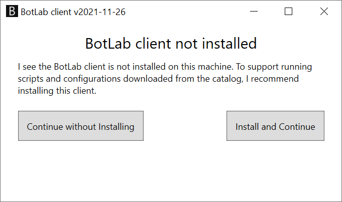
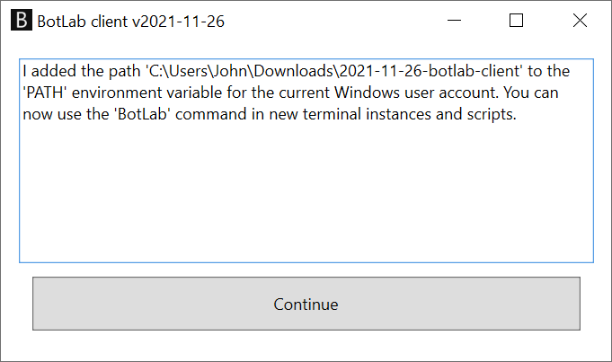

# How to Install the Botlab Client and Register the `botlab` Command

When you land here, you might have tried to use the `botlab` program in some form. Maybe you downloaded a script from the [botlab catalog](https://to.botlab.org/catalog), and got this error message when running the script:

> I failed to run the bot because I did not find the 'botlab.exe' program.

Or maybe you tried following instructions to run a command in Windows and got an error message like this:

> 'botlab' is not recognized as an internal or external command,
operable program or batch file.

The BotLab client program is a tool for developing and running bots, and many guides assume it is registered on your Windows system. To make these guides and scripts work, follow these steps:

+ Download the file from https://botlabs.blob.core.windows.net/blob-library/by-name/2022-01-25-botlab-client.zip
+ Extract the downloaded zip archive. The extraction will give you a file named `BotLab.exe`.
+ Run the `BotLab.exe` program, for example by double clicking the file in the Windows Explorer. It will open a window like in this screenshot:

+ To start the installation/registration, press the button labeled `Install and Continue`.
+ The program then confirms the successful installation with a new output like this:

That's it; the installation is complete. Now you can run bot configurations and scripts from the [botlab catalog](https://to.botlab.org/catalog)

If you have any questions, the [BotLab forum](https://forum.botlab.org) is a good place to learn more.