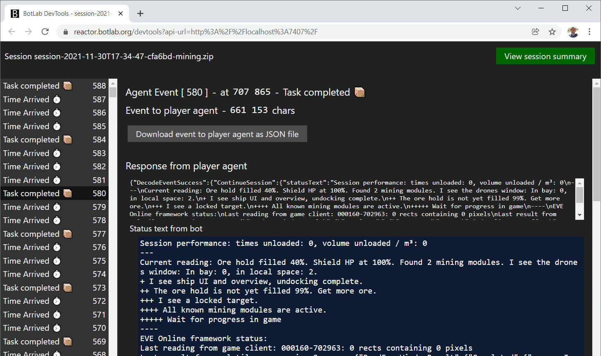

# How to Report an Issue with a Bot or Request a New Feature

Have you used a bot that should be improved?
This guide helps you report bugs and communicate ideas for new features.

Improving a bot starts with documenting the scenario(s) in which we want the bot to behave differently than it did so far. This applies to both fixing bugs and adding features.

These scenarios are the fuel for bot development. Developing bots is very much an incremental process. A bot evolves as we collect more scenarios describing the desired behavior.

Explaining your use-case in human language is a good start, but a developer will usually ask for more data.

## Session Recording and Archive

The most common way to describe your scenario or use-case is to share a recording of a play session using the bot.

The artifact of the session recording allows us to:

+ See which bot program was used in the session and how it was configured (including bot-settings).
+ Travel back in time and see what the bot saw in the past.
+ Understand why our bot did what it did.
+ Create simulations to test new program codes. ([Testing a bot using simulations](https://to.botlab.org/guide/testing-a-bot-using-simulations))
+ Extract training data used to adapt bot program codes to new users and their setups.

In summary, sharing a session recording is a fast and efficient way to answer many questions from people who want to help you.

### Getting the Session Recording Archive

How do you get a session recording that you can share with others?

By default, the BotLab client automatically creates that recording every time you run a bot. That means saving the session recording is already taken care of unless you chose to disable it for that session.

(If you have set the `--detailed-session-recording` switch to `off` on a session, the recording will not be available for that session)

To export a recording after running a bot, we use the `Devtools` in the BotLab client:

A button in the main menu brings us into the `Devtools` view:

Here we see a link to a web page on the `localhost` domain. Clicking that link brings opens a web browser. The actual graphical user interface for the Devtools is on this web page.

You find a list of recent play sessions on that web page, the last one at the top.

When you run a bot, the BotLab client window also displays the session's name, so you can find it again in this list later, even if you started other sessions in the meantime.

Clicking on one of the sessions' names brings us into the view of this particular session:

To export the session recording, use the `Download session recording archive` button. This gets you a zip archive that you can then share with other people. Now you can get help from other developers for your exact situation, no matter if the solution requires a change in program code or just different bot-settings.

### Inspecting a Session and Identifying the Time of Interest

Besides the session archive, a developer might ask you at which time the bot should have behaved differently. The longer the session, the more likely you will be asked to clarify this.

A precise way to communicate the time range of interest is to note the events indices for this range. Each action that a bot sends to a game client belongs to one event in the session timeline.

In the session view, there is a timeline of events in that session. The events are numbered so that we can identify them; each has its index.

A play session can easily contain thousands of events, and we want to find out what subsequence of events is related to the current problem or feature request.

Clicking on an event in the timeline opens the details for this event. Here you can see what the game looked like at that time and what the bot did. The event details contain the complete bot's response to this event, including the inputs to send to a game client.

Bot authors often use the status text to inform about what action the bot takes and how it decided to prefer this action. The bot generates a new status text for each event. The status texts for consecutive events can be very similar or even the same, especially if the bot was waiting for a process in the game to complete and did not take any action in the event.

