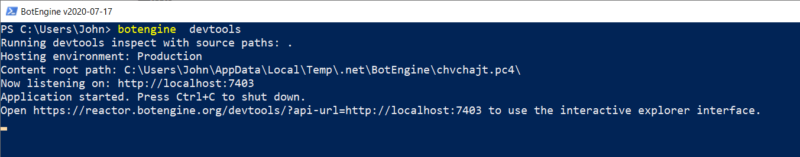
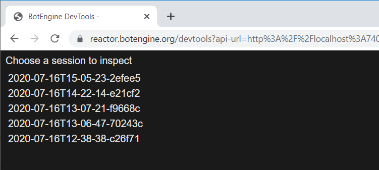
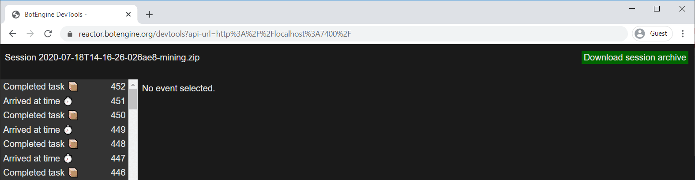
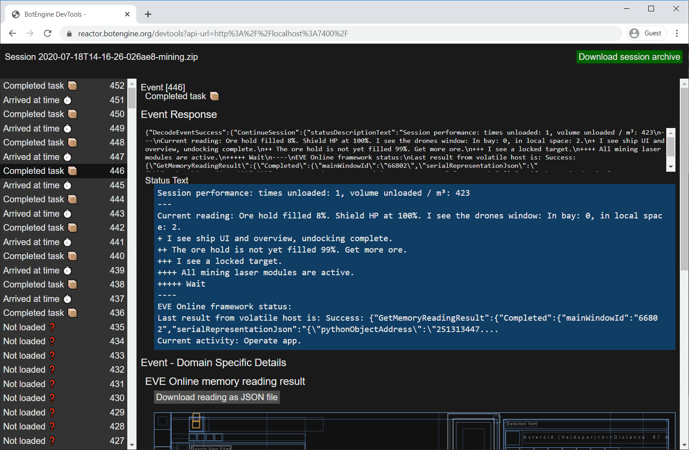

# How to Report an Issue with an App or Request a New Feature

Have you used a bot or other botengine app that should be improved?
This guide helps you report bugs and communicate ideas for new features.

Improving an app starts with documenting the scenario(s) in which we want the app to behave differently than it did so far. This applies to both fixing bugs and adding features.

These scenarios are the fuel for bot development. Developing these apps is very much an incremental process. A bot evolves as we collect more scenarios describing the desired behavior.

Explaining your use-case in human language is a good start, but a developer will usually ask for more data.

## App Session Recording and Archive

The most common way to describe your scenario or use-case is to share a recording of your session using the app.

The artifact of the app session recording allows us to:

+ See which app was used in the session and how it was configured (including app-settings).
+ Travel back in time and see what the bot saw in the past.
+ Understand why our bot did what it did.
+ Create simulations to test new program codes. ([Testing an app using simulations](https://to.botengine.org/guide/testing-an-app-using-simulations))

In summary, by providing a session recording, you answer many questions from people who want to help you.

### Getting the Session Recording Archive

How do you get a session recording that you can share with others?

By default, the botengine for Windows automatically creates that recording for you every time you run an app. That means saving the session recording is already taken care of unless you chose to disable it for that session.

(If you have set the `--detailed-session-recording` switch to `off` on a session, the recording will not be available for that session)

After running an app, use the `botengine  devtools` command to get a list of completed sessions:

You can enter this command, for example, in the 'Command Prompt' app that comes preinstalled with Windows.

Running this command opens a web browser window. From here on, you can continue in the web browser without looking at the command prompt window anymore.

On that web page, you find a list of recent app-sessions, the last one at the top.

When you run an app, the engine window also displays the session's name, so you can find it again in this list later, even if you started other sessions in the meantime.

Clicking on one of the names of the sessions brings you into the view of this particular session:

You can click the button "Download session archive" to get the session recording bundled in a single file.

### Inspecting a Session and Identifying the Time of Interest

Besides the session archive, a developer might ask you at which time the app should have behaved differently. The longer the session, the more likely you will be asked to clarify this.

A precise way to communicate the time range of interest is to note the app events indices for this range. Each action that a bot sends to a game client belongs to one event in the session timeline.

In the session view, there is a timeline of events in that session. The events are numbered so that we can identify them; each has its index.

A bot session can easily contain thousands of events, and we want to find out what subsequence of events is related to the current problem or feature request.

Clicking on an event in the timeline opens the details for this event. Here you can see what the game looked like at that time and what the bot did. The event details contain the complete app's response to this event, including the inputs to send to a game client.

Bot authors often use the status text to inform about what action the bot takes and how it decided to prefer this action. The app generates a new status text for each event. The status texts for consecutive events can be very similar or even the same, especially if the bot was waiting for a process in the game to complete and did not take any action in the event.

