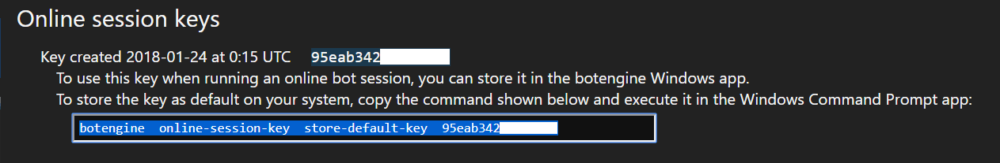

# How to Run a Bot

## What is a Bot?

A bot is a software which performs the following steps:

+ Learn about the current state of the game world by reading information from the game client. Usually, the bot does this by taking screenshots of the game client. In the case of EVE Online, we can also use [memory reading](https://github.com/Arcitectus/Sanderling) to get information from the game client.
+ Accomplish an in-game effect by sending inputs such as mouse clicks or key presses to the game client.

The bot runs as a continual process repeating these steps again and again until it reaches the configured goal or you stop it.

There also exists monitoring software which does not send any input to the game, but notifications to inform you about in-game events. You can use the BotEngine console to run these too.

## Starting a Bot

Download the BotEngine Windows console app from 
[https://botengine.blob.core.windows.net/blob-library/by-name/2020-05-11-botengine-console.zip](https://botengine.blob.core.windows.net/blob-library/by-name/2020-05-11-botengine-console.zip).

Extract this Zip-Archive. This will give you a file named `BotEngine.exe`. To start a bot, call this program with a command like the following:

```cmd
C:\path\to\the\BotEngine.exe  run-bot  "https://github.com/Viir/bots/tree/cbd803d5bb2fd49de2ef892bb7da964f9791c4f5/implement/applications/eve-online/eve-online-warp-to-0-autopilot"
```

You can enter this command in the Windows app called ['Command Prompt' (cmd.exe)](https://en.wikipedia.org/wiki/Cmd.exe). This app comes by default with any Windows 10 installation.

The engine then loads the bot from the specified location and runs it until you stop it or the bot stops itself.

### The `bot-source` Parameter

The `bot-source` parameter at the end of the command tells the engine where to load the bot code from. It can point to different kinds of sources:

+ A directory on the local file system. Example: `C:\directory-containing-bot-code`.
+ A directory in a repository on [Github](https://github.com). Example: `https://github.com/Viir/bots/tree/cbd803d5bb2fd49de2ef892bb7da964f9791c4f5/implement/applications/eve-online/eve-online-warp-to-0-autopilot`

Developers use Github to collaborate and share code. Using the local file system as the source can be more convenient when you make changes to the bot code which you only want to test yourself.

## Operating the Bot

While a bot is running, the engine displays status information in the console window. This display is updated as the bot continues operating.
Most of the time, you don't need to watch this. After all, that is the point of automation right?

But in case a bot gets stuck, you want to take a look at this status display. Among general information from the engine, this display can also contain information as coded by the bot author. This way, the bot can tell about the goal of its current actions or inform you about problems. For example, this [warp to 0 auto-pilot bot](https://github.com/Viir/bots/tree/cbd803d5bb2fd49de2ef892bb7da964f9791c4f5/implement/applications/eve-online/eve-online-warp-to-0-autopilot) shows diverse messages to inform you what it is doing at the moment. When you run this bot, the console window might show a text like the following:

```
Bot is running. Press SHIFT + CTRL + ALT keys to pause the bot
Last bot event was 1 seconds ago at 15-09-48.781.
Status message from bot:

I see no route in the info panel. I will start when a route is set.
```

You can pause bot operation by pressing the `SHIFT` + `CTRL` + `ALT` keys. To let the bot continue, focus the console window and press the enter key. The key combination `CTRL` + `C` stops the bot and the botengine process.

## Configuring a Bot

Some bots offer customization using settings. When starting a bot from the command line, you can use the `--app-settings` parameter to apply settings. The complete command line can then look as follows:
```cmd
C:\path\to\the\botengine.exe  run-bot  --app-settings="My app settings"  "https://github.com/Viir/bots/tree/c4911ff9a0c3a279209e31a61b63bfa736c8f3c5/implement/templates/remember-app-settings"
```

The supported settings depend entirely on the bot that you chose. To learn which settings are supported in your case, read the description for the bot or contact its author.

## Viewing Bot Description

Authors often include a human-readable description with the bot code, for example, in [this EVE Online mining bot](https://github.com/Viir/bots/tree/8db3758e0bb81a0a1a6016b1a049f5f55a1b6b4a/implement/applications/eve-online/eve-online-mining-bot/src/Bot.elm).

You can display this description using the `describe-bot` command:

```cmd
C:\path\to\the\BotEngine.exe  describe-bot  "https://github.com/Viir/bots/tree/8db3758e0bb81a0a1a6016b1a049f5f55a1b6b4a/implement/applications/eve-online/eve-online-mining-bot"
```

The `describe-bot` command works with any bot source that is supported by the `run-bot` command.

The information you get this way includes the description given by the author of the app. This description often contains a guide on how to use the app.

## Online Bot Sessions

When running a bot, you can choose to start it in an online bot session. Online bot sessions provide several advantages over offline sessions:

+ Monitoring from any device: No need to go to your PC to check the status of your bot. You can use your smartphone or any other device with a web browser to see the status of your bot.
+ Organize and keep track of your operations and experiments: Easily see which bots you already tested and when you used them the last time.
+ Longer bot running time: Run a bot continuously in one session for up to 72 hours.

To see a list of your most recent online bot sessions, log in at https://reactor.botengine.org

Below is a screenshot of the website you can use to view your online bot sessions and monitor your bots:


Online bot sessions cost 2000 credits per hour. To add credits to your account, follow the instructions at [https://reactor.botengine.org/billing/add-credits](https://reactor.botengine.org/billing/add-credits)

For more about purchasing and using credits, see the guide at [https://forum.botengine.org/t/purchasing-and-using-botengine-credits-frequently-asked-questions-faq/837](https://forum.botengine.org/t/purchasing-and-using-botengine-credits-frequently-asked-questions-faq/837)

### Starting an Online Bot Session

To start an online session, use the `--online-session` option with the `run-bot` command.

Below is an example of a full command to run a bot in an online session:
```cmd
botengine  run-bot  --online-session  "https://github.com/Viir/bots/tree/652ed9fc83aa3f04cb21c1cbf28911201bd53925/implement/templates/remember-app-settings"
```

If you have not set up your system for online sessions, the engine then stops with this error:

```cmd
Error: You used the '--online-session' option, but I did not find a stored default online session key. Use the 'online-session-key  store-default-key' command to store a key.
```

To get your key, go to https://reactor.botengine.org and log in to your account. After logging in, you see a section titled `Online session keys`. In this section, there is an entry for a key, containing a button labeled `Show key`. Clicking this button reveals your key. Please don't share this key with anyone, and don't post it on the forum.

Besides the key itself, clicking the `Show key` button also reveals the complete command you can use to store the key on your system:



Copy that command from the web page into the Windows Command Prompt and execute it.

The program then confirms:

```text
I stored this as the default key. You can now use it with the 'run-bot' command by adding the '--online-session' option.
```

Now you can use the `run-bot` command again to start the online session.

After the online session is started, you can also see it at https://reactor.botengine.org/ under `Most recent bot sessions`:


Clicking on the session ID brings you to the details view of the session, where you can also see the status reported by the bot.

The sessions under `Most recent bot sessions` are still available after stopping the Windows app, so you can continue to view details of past sessions.

## Getting Help

If you have any questions, the [BotEngine forum](https://forum.botengine.org) is a good place to learn more.
