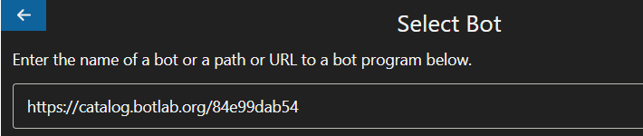
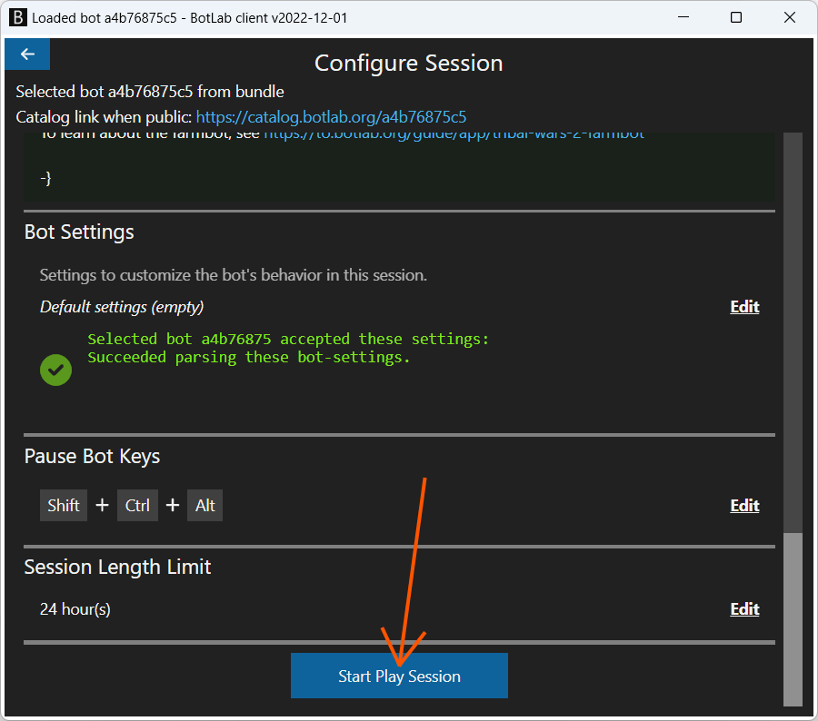

# How to Run a Bot

We can find countless bot program codes on the internet, on code hosting sites like GitHub and other websites. But how to run such a bot program? Following is a detailed walkthrough on how to run a bot program using the BotLab client.

## Prerequisites - Installing the BotLab client on Windows

Before running any bot for the first time, we install the BotLab client on Windows. If you are not sure you have done this on your system already, check the installation guide at <https://to.botlab.org/guide/how-to-install-the-botlab-client>

## Running a Bot

Here is a video showing how to start a live run of a bot, also covering the initial download and installation: https://to.botlab.org/guide/video/how-to-run-a-bot

After following the installation guide, our Windows system is ready to run bots. When we open the BotLab client that we installed in the previous step, we see this screen:


The most common way to run a bot is to use this graphical interface. For expert users and developers, a command-line interface offers another route to run a bot, but this guide only covers the graphical interface.

After clicking on the 'Run Bot' button, we land on this screen where we can select which bot we want to run:


The BotLab client supports running bot programs from many different sources. The 'Select Bot' screen contains a single text input field to name the bot we want to use. Here we enter a bot's name or a path to a file or directory containing a bot program.
A path can point, for example, to a directory on our computer, such as `C:\my-bot-programs\awesome-bot`
It can also point to a public git repository on git hosting services like [GitHub](https://github.com) and [GitLab](https://gitlab.com).
If a developer has sent us a zip archive containing a bot program, we can also enter the path to the zip archive directly, like `C:\Users\John\Downloads\bot-program.zip`. The BotLab client will do the extraction automatically in the background, so we don't need to unpack the archive manually.
We can also enter any bot ID or short name, as seen on the BotLab catalog at <https://catalog.botlab.org>



By pressing the 'Load Bot' button, we advance into the 'Configure Session' view.


Here we can configure various aspects of the new bot session. At the top of the 'Configure Session' view, we see the description of the bot we selected in the previous step. In some cases, we will refer to this description to better understand which activities the selected bot can carry out for us.

In some cases, the description will help us understand that the selected bot is not a good match for the in-game activity we want to automate. In this case, we can go back to the bot selection stage using the 'back' button in the upper left corner.

The various configurations offered further down are optional. The fastest way to run the bot is to skip changing them and scroll past them down to the bottom. Here we find the 'Start Play Session' button to start running the bot.




### Operating the Bot

When running a bot live, the engine displays status information in the console window. This display is updated as the bot continues operating.
Most of the time, you don't need to watch this. After all, that is the point of automation right?

To go back in time and see past status information from the bot, you can use the time-travel functionality in the devtools: https://to.botlab.org/guide/observing-and-inspecting-a-bot

But in case a bot gets stuck, you want to take a look at this status display. Among general information from the engine, this display can also contain information as coded by the author. This way, the bot can tell you about the goal of its current actions or inform you about problems. For example, this [auto-pilot bot](https://github.com/Viir/bots/tree/e1eac00ab6a818e722fd64d552a2615d78f9628b/implement/applications/eve-online/eve-online-warp-to-0-autopilot) shows diverse messages to inform you what it is doing at the moment. When you run this bot, the botlab client might show a text like the following in the section 'Status text from bot':

```
jumps completed: 0
current solar system: Kemerk
+ I see ship UI and overview, undocking complete.
++ I see no route in the info panel. I will start when a route is set.
+++ Wait
```

You can pause the bot by pressing the `SHIFT` + `CTRL` + `ALT` keys. To let the bot continue, focus the console window and press the enter key. The key combination `CTRL` + `C` stops the bot and the BotLab client process.


## Running a Bot in a Simulated Environment

Running a bot can serve various goals. We categorize those goals broadly into two groups as follows:

1. **To achieve an effect in some other system or software, like a game client.** In this case, we want the bot to interact with the world around it. The bot reads information from and sends inputs to another software. We call this a 'live' or 'productive' run.

2. **To understand how the bot works or to test if it works as expected.** In this case, we isolate the bot in a simulation, which means it cannot send any inputs and not affect any other software. We call this a 'simulated' or 'test' run.

Every time we start running a bot, we choose one of these two modes, depending on whether we want it to work in a live environment or test it. There is no difference between a live run and a simulated run from the bot's perspective. The bot does not know if it is running in a simulation.

To learn about testing a bot using simulated environments, see the dedicated guide at https://to.botlab.org/guide/testing-a-bot-using-simulated-environments
