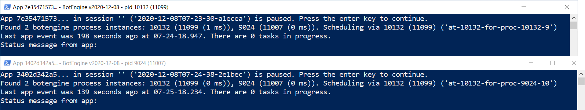

# Input Focus Scheduling for Multiple Bot Instances

Input focus scheduling is a technique to resolve the contention for device input focus between multiple bots. This problem occurs when we run multiple bots requiring input focus on the operating system level in parallel.

Not all bots require input focus on this level. For example, bots interacting with websites can use web browsers' programmatic interfaces to send input without depending on the OS input focus.

However, many bots simulate input from the mouse or keyboard to control apps. This way of sending inputs works similar to a human using the mouse and keyboard manually.

Bots don't send their inputs instantaneously but in sequences that can span several hundred milliseconds. Take, for example, a drag&drop gesture: A bot can use four steps to perform this gesture: 1. Move the mouse cursor to the start location. 2. Press down the mouse button. 3. Move the mouse cursor to the destination. 4. Release the mouse button. Bots also often insert small pauses between these steps. 

On operating systems like Windows, we can simultaneously run multiple apps. Each app has its user interface contained in a window. When you press a key, the input focus determines which of these windows receives the input.

Before sending inputs, a bot switches the input focus to the right window if necessary. Most bots have no problem if a user takes over for a second and interrupts the input flow. The bot will automatically switch back to the right window. In case one of the inputs planned by the bot got lost, the bot will see the effect was not achieved yet and plan the input again. (This is in contrast to a macro, which blindly sends inputs without checking the current state of the target app)

Such interference will slow down the bot as it has to repeat the inputs more often. When we run multiple bots that send inputs often, this can become a problem.

## Avoiding Interference Through Input Focus Scheduling

When we run multiple bots simultaneously on the same machine, the input focus becomes a shared resource. Scheduling enables us to make the best use of this resource and prevent the interference problems described above.

The botengine software comes with built-in support for input focus scheduling. The bot program code sends a sequence of inputs, like the one in the drag&drop example above, to the engine in one package. The botengine hosting this bot then coordinates with the other instances to find a time slot for the input package. When giving such a package to the engine, the bot also specifies a maximum wait time to acquire input focus. In case there is no time-slot available soon enough, the engine informs the bot that the acquisition of input focus failed.

From the user's perspective, there is no big difference to running just one bot instance. Each bot is still started the same way, in a separate process. Each instance of the botengine automatically connects to the other currently running instances. They then elect one instance to act as a central scheduler. This scheduling instance takes requests from the other ones and assigns time slots. When the scheduling instance disappears, the remaining ones will elect a new scheduler.

This design means there is no need to start or stop the bots together. And we can use any mixture of bot apps since all the scheduling program is on the engine side.

When two or more bots run on the same machine, they display information about the scheduling functionality. The engine window lists the other botengine instances found on a line starting with `Found X botengine process instances:`

The screenshot below is an example with two bots running:

For each found instance, it lists their process ID and the TCP port they use for communicating. The number left of the `ms` label is the number of milliseconds it took the displaying instance to get a response from the displayed instance. In the screenshot above, we can see it was less than two milliseconds for all the directions.
At the label `Scheduling via`, the engine window also shows which instance currently has the scheduler role.

