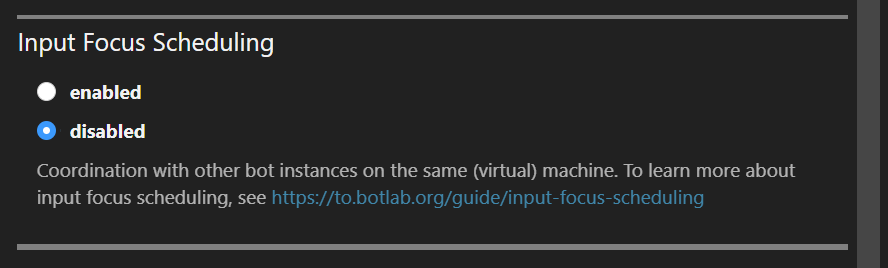

# Input Focus Scheduling for Multiple Bot Instances

Input focus scheduling is a technique to resolve the contention for device input focus between multiple bots. This problem occurs when we run multiple bots requiring input focus on the operating system level in parallel.

Not all bots require input focus on this level. For example, bots interacting with websites can use web browsers' programmatic interfaces to send input without depending on the OS input focus.

However, many bots simulate input from the mouse or keyboard to control apps. This way of sending inputs works similar to a human using the mouse and keyboard manually.

Bots don't send their inputs instantaneously but in sequences that can span several hundred milliseconds. Take, for example, a drag&drop gesture: A bot can use four steps to perform this gesture: 1. Move the mouse cursor to the start location. 2. Press down the mouse button. 3. Move the mouse cursor to the destination. 4. Release the mouse button. Bots also often insert small pauses between these steps. 

On operating systems like Windows, we can simultaneously run multiple apps. Each app has its user interface contained in a window. When you press a key, the input focus determines which of these windows receives the input.

Before sending inputs, a bot switches the input focus to the right window if necessary. Most bots have no problem if a user takes over for a second and interrupts the input flow. The bot will automatically switch back to the right window. In case one of the inputs planned by the bot got lost, the bot will see the effect was not achieved yet and plan the input again. (This is in contrast to a macro, which blindly sends inputs without checking the current state of the target app)

Such interference will slow down the bot as it has to repeat the inputs more often. When we run multiple bots that send inputs often, this can become a problem.

## Avoiding Interference Through Input Focus Scheduling

When we run multiple bots simultaneously on the same machine, the input focus becomes a shared resource. Scheduling enables us to make the best use of this resource and prevent the interference problems described above.

The BotLab client software comes with built-in support for input focus scheduling. The bot program code sends a sequence of inputs, like the one in the drag&drop example above, to the host in one package. The client instance hosting this bot then coordinates with the other instances to find a time slot for the input package. When giving such a package to the host, the bot also specifies a maximum wait time to acquire input focus. In case there is no time-slot available soon enough, the host informs the bot that the acquisition of input focus failed.

From the user's perspective, there is no big difference to running just one bot instance. Each bot is still started the same way, in a separate process. Each instance of the BotLab client automatically connects to the other currently running instances. They then elect one instance to act as a central scheduler. This scheduling instance takes requests from the other ones and assigns time slots. When the scheduling instance disappears, the remaining ones will elect a new scheduler.

This design means there is no need to start or stop the bots together. And we can use any mixture of bots since all the scheduling program is on the host side.

When running a bot, the BotLab client displays information on the input scheduling in the 'Play Session' view.

The screenshot below is an example with two bots running, each on their own instance of the BotLab client:

This view shows the count of other instances currently running bots that require input focus. Bots that run entirely in the background, like inside a web browser, do not increase the count here.

At the label `scheduling via`, the BotLab client window also shows the process ID of the instance that currently has the scheduler role.

In the screenshot above, we see that every instance connects to the same BotLab client instance to coordinate the scheduling of inputs to the game clients.

## RDP as Alternative to Input Focus Scheduling

Input-focus scheduling is not the only way to prevent interference between multiple bots on the same machine. Another option is to use a remote desktop connection to the machine. We get a separate desktop session by connecting to a machine via RDP. Each desktop has a separate input focus, so we can run a bot in an RDP session without interference from other bots running on the same machine.

The more bots you run on the desktop, the greater the average delay for a bot to wait for its turn. The RDP approach avoids these delays by enabling multiple desktop sessions on the same machine.

When using RDP or another approach to isolate a bot instance, turn off that session's input focus scheduling feature to avoid unnecessary delays of the bot's inputs to the game.
You can turn off input focus scheduling in the 'Configure Session' view before starting a new play session:

In the active play session view, the software then shows the text "scheduling disabled by session config":

### How to Allow Multiple RDP Sessions in Windows 10 and 11?

Compared to input focus scheduling, the RDP solution has the disadvantage of requiring a setup on the machine.
There is a guide on setting up RDP at <https://woshub.com/how-to-allow-multiple-rdp-sessions-in-windows-10/>
