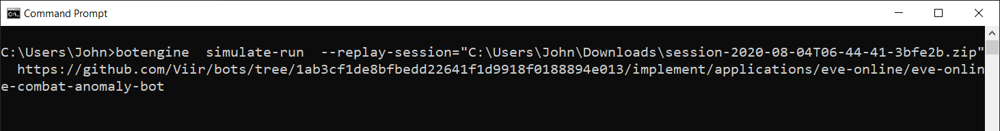
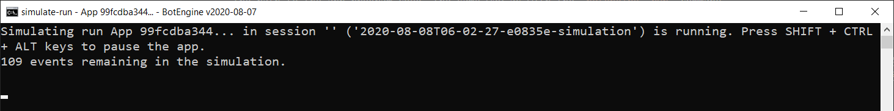

# Testing an App Using Simulations

Simulations are a great time saver when it comes to testing and debugging an app. Simulations let us test a complete app without the need to start a game client.

When we run an app for productive use, we want it to interface with a real game client. For the app to be useful, it needs to affect the game world or read and forward information from the game.

During development, our goals are different. We are confronted with a vast amount of possible program codes and want to test and compare those. There are various ways to find program codes. We could write it ourselves or copy it from somewhere else. But no matter how we find program code, we want to test it before letting it run unattended for hours. We want to check if it works for our scenarios. For these tests, we often want to run different program codes in the same scenario, to compare their fitness. Setting up a game client for each test would be a distraction and would slow us down.

But even after the setup, testing a new bot on a real game client can still require further work. If we let a new, previously untested bot run unattended, it might put in-game resources at risk.

To test and compare apps faster and without risk, we use simulations. Simulations allow us to test different apps in the same scenario, without using a live game client.

How does this work? It is helpful to remember that all information that an app receives comes through events. This also implies that the sequence of events in a session determines all outputs of an app.

In the case of productive use, the app events encode information from the user (app-settings) and the game client. When we run a simulation, another program generates the events that the app receives.

## Simulation from Session Replay

The simplest type of simulation is replaying a session. This is a kind of off-policy simulation, which means the app's output is not fed back into the simulation.

To create a simulation by session replay, we only need the recording of a session as input. Here we can use a session archive as we get it from the [export function in DevTools](https://to.botengine.org/guide/how-to-report-an-issue-with-an-app-or-request-a-new-feature).

We can start a session replay by using the `botengine  simulate-run` command with the `--replay-session` option. We use the `--replay-session` to point to the file containing the session recording archive. After the `--replay-session` option, we add the path to the app program code, the same way as with the `botengine  run` command.
Here is an example of the final command as we can run it in the Windows Command Prompt:

```
botengine  simulate-run  --replay-session="C:\Users\John\Downloads\session-2020-08-04T06-44-41-3bfe2b.zip"  https://github.com/Viir/bots/tree/1ab3cf1de8bfbedd22641f1d9918f0188894e013/implement/applications/eve-online/eve-online-combat-anomaly-bot
```



When running this command, the output looks similar to when running an app live. The same way as when running an app live, we see a session ID that we can use later to find the details of this simulated session again. One difference you can see is that the engine displays the number of remaining events to be processed:



The simulation runs faster than the original session because it never has to wait for another process, and the passing of time is encoded in the app event data.

When the simulation is complete, we find the recording in the list of sessions shown in DevTools. (You might have to restart DevTools to make a new session visible). By selecting the session recording in DevTools, you can inspect it the same way as any other session recording. The guide on observing and inspecting an app explains how this works: https://to.botengine.org/guide/observing-and-inspecting-an-app

### Replacing App-Settings in a Session Replay

When developing a new feature for your app, you sometimes want to add a new app-setting to let users configure that feature. But how do you test this with a session replay? The app-settings are defined in the session events, so we don't want an exact replay but one with modified events.

To make modifying the app-settings events easy, the `simulate-run` command offers the `--replace-app-settings` option. When you use this option, the engine replaces the app-settings string with the new value for each app-settings event in the loaded session, before giving it to the app.

## Related Resources

You can see an example of simulations in action in this video: https://youtu.be/pL1zLGYn8jQ?t=583
