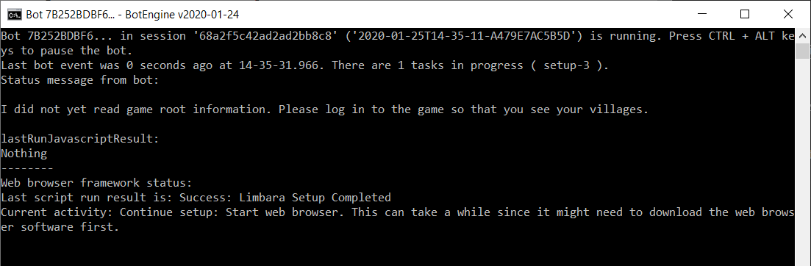
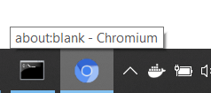

# Farm Manager - Tribal Wars 2 Farmbot

This bot farms barbarian villages in Tribal Wars 2.
It automatically detects barbarian villages, available troops and configured army presets to attack.

## Features

### Easy to Configure

+ Automatically reads the required information from the game: Locations of farms, available units, army presets, current attacks per village, etc.
+ You can use the in-game army presets to configure which villages should attack and which units to use.

### Efficient

+ Supports multiple army presets per village to make the best use of your troops.
+ Takes into account the limit of 50 attacks per village.

### Safe

+ Supports random breaks between farming cycles.
+ Uses a normal web browser to interact with the game server for maximum security.
+ Stops the farming when the configured time limit is met to avoid perpetual activity on your account.

## Starting the Farmbot

Download the BotEngine console app from the following address:
[https://botengine.blob.core.windows.net/blob-library/by-name/2020-01-24.botengine-console.zip](https://botengine.blob.core.windows.net/blob-library/by-name/2020-01-24.botengine-console.zip). Extract this Zip-Archive. This will give you a file named `BotEngine.exe`.

To start the farmbot, run the `BotEngine.exe` program with the following command:

```cmd
C:\path\to\the\BotEngine.exe  run-bot  "https://github.com/Viir/bots/tree/42b11c257f99c61538b7060ea1a4fd4f7d40f0eb/implement/applications/tribal-wars-2/tribal-wars-2-farmbot"
```
You can enter this command in the Windows app called ['Command Prompt' (cmd.exe)](https://en.wikipedia.org/wiki/Cmd.exe). This app comes by default with any Windows 10 installation.

After you have entered this command, the bot needs a few seconds to start.
The first time you start the bot, it will download a web browser component which does not come with the original download. This can take some time, depending on your internet connection.



When the browser download is finished, the bot opens a 'chromium' web browser window which is a kind of chrome (has a blueish version of the google chrome logo):



In the browser window opened by the bot, navigate to the Tribal Wars 2 website and log in to your world so that you see your villages.
Then the browsers address bar will probably show an URL like https://es.tribalwars2.com/game.php?world=es77&character_id=12345

Now the bot will probably display a message like this:

> Found no army presets matching the filter 'farm'.

### Configuring Army Presets

The bot only uses an army preset that matches the following three criteria:

+ The preset name contains the string 'farm'.
+ The preset is enabled for the currently selected village.
+ The village has enough units available for the preset.

If multiple army presets match these criteria, it uses the first one by alphabetical order.

If no army preset matches this filter, it switches to the next village.

You can use the in-game user interface to configure an army preset and enable it for villages:


Besides the army presets, no configuration is required.
The bot searches for barbarian villages and then attacks them using the matching presets. You can also see it jumping to the barbarian villages on the map.

In the console window, it displays the number of sent attacks and other information:

> Found 3 own villages. Currently selected is 871 (482|523 'Segundo pueblo de skal'. Last update 6 s ago. 179 available units. Best matching army preset for this village is 'farm beta'. 49 outgoing commands.)  
> Sent 129 attacks.  
> Checked 1413 coordinates and found 364 villages, 129 of wich are barbarian villages. 

## Further Configuration

In case you need the bot to run more than 15 minutes per session, use an online-bot session as explained at [https://github.com/Viir/bots/blob/master/guide/how-to-run-a-bot.md#online-bot-sessions](https://github.com/Viir/bots/blob/master/guide/how-to-run-a-bot.md#online-bot-sessions)

## Getting Help

If you have any questions, the [BotEngine forum](https://forum.botengine.org) is a good place to learn more. You can also contact me at [support@botengine.org](mailto:support@botengine.org?subject=Tribal%20Wars%202%20Farmbot%20-%20your%20issue%20here)

When asking for help with the bot, include the complete text from the console window or a screenshot. Make sure screenshots are well readable. Don't try to insert a screenshot directly into the forum, as it will be compressed and unreadable. When posting on the forum, you can link screenshots hosted at other sites like Github or imgur.
