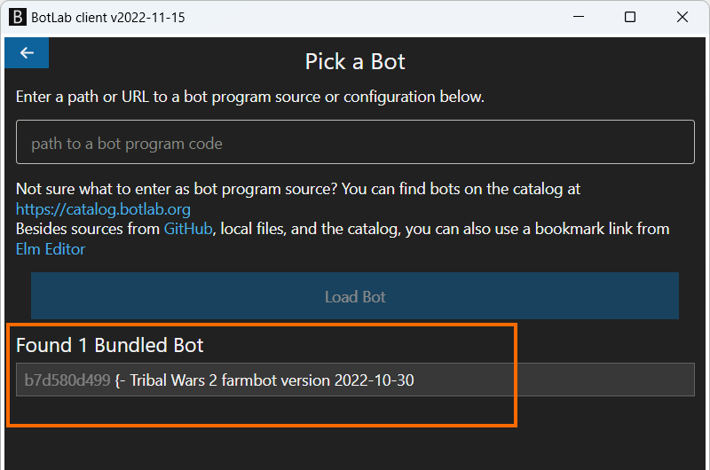
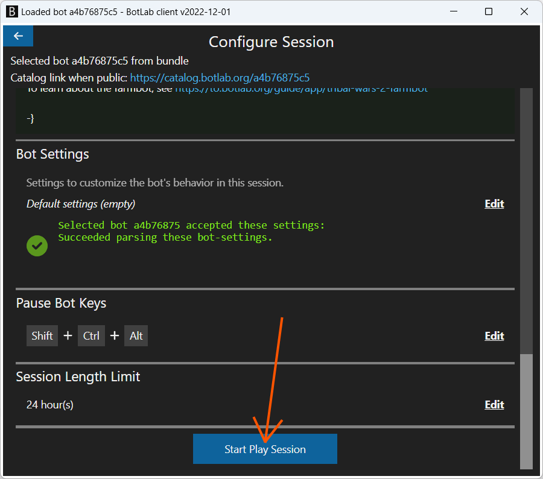
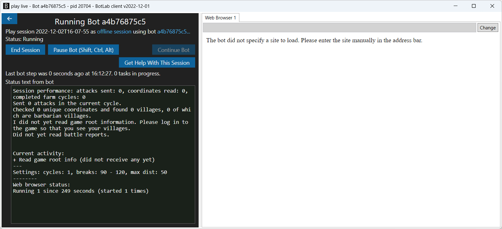
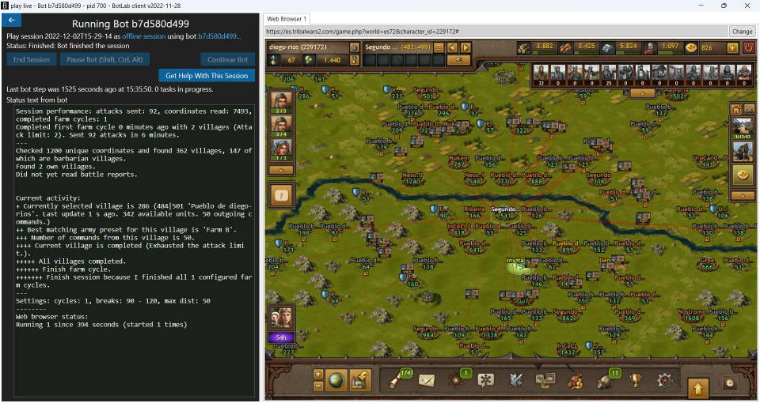
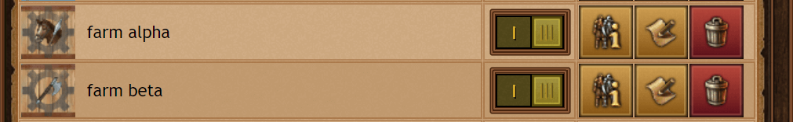
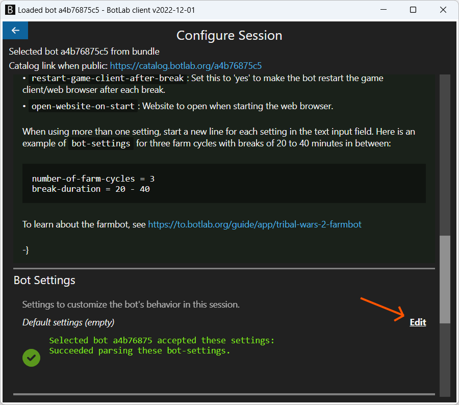
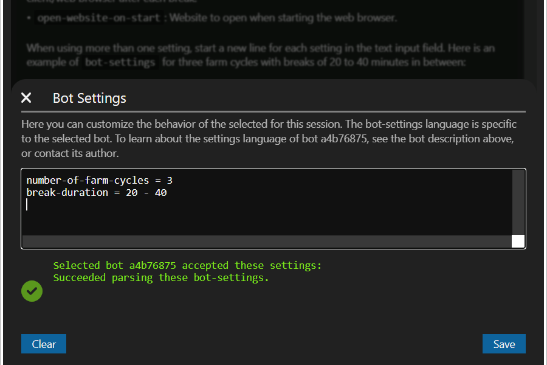
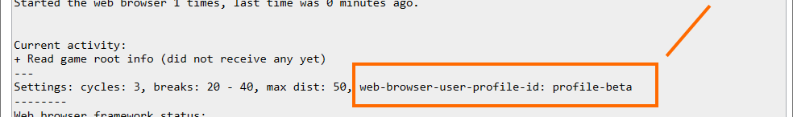

# Farm Manager - Tribal Wars 2 Farmbot

This bot farms barbarian villages in Tribal Wars 2.
It automatically detects barbarian villages, available troops and configured army presets to attack.

## Features

### Easy to Use

+ Automatically reads the required information from the game: Locations of farms, available units, army presets, current attacks per village, etc.
+ Use the in-game army presets to configure which villages should attack and which units to use.
+ Requires no input focus: You can continue using your PC as usual while the bot runs in the background. 

### Efficient

+ Fast enough to send 800 attacks per hour.
+ Supports multiple army presets per village to make the best use of your troops.
+ Takes into account the limit of 50 attacks per village.
+ Option to skip barbarian villages under a certain amount of points.
+ Avoid having your troops die at remaining walls: Option to skip barbarian villages with specific coordinates.
+ Supports running on multiple accounts simultaneously on a single PC.

### Safe

+ Supports random breaks between farming cycles.
+ Uses a normal web browser to interact with the game server for maximum security.
+ Stops the farming when the configured time limit is met to avoid perpetual activity on your account.

## Starting the Farmbot

This video shows the process of starting the farmbot and setting up your Tribal Wars 2 account:

https://youtu.be/yzkernqechE

Following are the first steps shown in the video:

+ Download the file from https://botlabs.blob.core.windows.net/blob-library/by-name/2022-12-02-tribal-wars-2-farmbot.zip
+ Extract the downloaded zip archive. The extraction will give you a file named `tribal-wars-2-farmbot.exe`.
+ Run the `tribal-wars-2-farmbot.exe` program.
+ Click on 'Continue without Installing'
+ Click on 'Run Bot'

Then we land on this screen where we can select the Tribal Wars 2 farmbot:



+ Here click on the 'Tribal Wars 2 farmbot' under 'Bundled Bot'
+ On the next screen, scroll down and click the button 'Start Play Session'



Then the bot starts and we see a screen like this:



In the left pane, we see information about the play session and controls to pause and continue the bot. The left pane also shows a status report from the bot under 'Status text from bot'.

Here the bot also informs us about any setup we need to complete manually.
When we have just started the session, the bot also shows this text:

> I did not yet read game root information. Please log in to the game so that you see your villages.

In the right pane, the bot opens a web browser tab. The web browser tab is initially empty, but there is an address bar at the top where we can enter a new web page to load, just as in other web browsers.
Here we enter the address of the Tribal Wars 2 game world we want to enter with the bot. Since the browser by the bot is entirely separate from other web browsers and has a different user profile, we need to log in to the game to be able to enter the game world.
After logging in and selecting the game world, this new browser tab shows the game as any other web browser:



Then the bot displays a message like this:

> Found no army presets matching the filter 'farm'.

Or, in case our Tribal Wars 2 account has no army presets configured at all, it shows this message:

> Did not find any army presets. Maybe loading is not completed yet.

In any case, we need to configure at least one army preset before the bot can start farming.

### Configuring Army Presets

The bot only uses army presets matching the following three criteria:

+ The preset name contains the string 'farm'. ('farm' is only the default pattern, we can change it in the bot settings)
+ The preset is enabled for the currently selected village.
+ The village has enough units available for the preset.

If multiple army presets match these criteria, it uses the first one by alphabetical order.

If no army preset matches this filter, it switches to the next village.

You can use the in-game user interface to configure an army preset and enable it for villages:



Besides the army presets, no configuration is required.
The bot searches for barbarian villages and then attacks them using the matching presets. You can also see it jumping to the barbarian villages on the map.

Under 'Status text from bot', you can read about the number of sent attacks and what the bot is currently doing:

```text
Session performance: attacks sent: 129, coordinates read: 1478, completed farm cycles: 1
---
Sent 129 attacks in the current cycle.
Checked 1413 unique coordinates and found 364 villages, 129 of wich are barbarian villages.
Found 3 own villages.

Current activity:  
+ Currently selected village is 871 (482|523 'Segundo pueblo de skal'. Last update 6 s ago. 537 available units. 11 outgoing commands.)
++ Best matching army preset for this village is 'farm beta'.
+++ Farm at 567|524.
++++ Send attack using preset 'Farm 1'.
[...]
```

When all your villages are out of units or at the attack limit, the bot stops with this message:

> Finish session because I finished all 1 configured farm cycles.

## Configuration Settings

All settings are optional; you only need them in case the defaults don't fit your use-case.
Following is a list of available settings:

+ `number-of-farm-cycles` : Number of farm cycles before the bot stops. The default is only one (`1`) cycle.
+ `break-duration` : Duration of breaks between farm cycles, in minutes. You can also specify a range like `60 - 120`. The bot then picks a random value in this range.
+ `farm-barb-min-points`: Minimum points of barbarian villages to attack.
+ `farm-barb-max-distance`: Maximum distance of barbarian villages to attack.
+ `farm-avoid-coordinates`: List of village coordinates to avoid when farming. Here is an example with two coordinates: '567|456 413|593'. This filter applies to both target and sending villages.
+ `farm-player`: Name of a player/character to farm. By default, the bot only farms barbarians, but this setting allows you to also farm players.
+ `farm-army-preset-pattern`: Text for filtering the army presets to use for farm attacks. Army presets only pass the filter when their name contains this text.
+ `limit-outgoing-commands-per-village`: The maximum number of outgoing commands per village before the bot considers the village completed. By default, the bot will use up all available 50 outgoing commands per village. You can also specify a range like `45 - 48`. The bot then picks a random value in this range for each village.
+ `restart-game-client-after-break`: Set this to 'yes' to make the bot restart the game client/web browser after each break.
+ `open-website-on-start`: Website to open when starting the web browser.

You can enter any combination of settings before starting the bot. When in the 'Configure Session' view, scroll to the 'Bot Settings' section and click on 'Edit'.



This opens a popup where you can enter a settings text:



When using more than one setting, start a new line for each setting in the text input field.
Here is an example for three farm cycles with breaks of 20 to 40 minutes in between:

```text
number-of-farm-cycles = 3
break-duration = 20 - 40
```

After entering the settings, use the 'Save' button to apply these to the new session.

When you have applied settings for multiple farm cycles, the bot displays this message during the breaks between farm cycles:

> Next farm cycle starts in 17 minutes. Last cycle completed 16 minutes ago. 

## Pricing and Online Sessions

You can test the bot for free. When you want the bot to run more than 15 minutes per session, use an online session as explained at <https://to.botlab.org/guide/online-session>

Online sessions cost 2000 credits per hour. To add credits to your account, follow the instructions at <https://reactor.botlab.org/billing/add-credits>

For more about purchasing and using credits, see the guide at <https://forum.botlab.org/t/purchasing-and-using-botlab-credits-frequently-asked-questions-faq/837>

## Frequently Asked Questions

### How can I make the bot remember the locations of the barbarian villages?

To make it remember the farm locations, configure the number of farm cycles to be at least two. The bot automatically remembers all locations of barbarian villages within the same session, so it can reuse this knowledge, starting with the second farm cycle. It sends only one attack per target per farm cycle, so the remembering does not affect the first farm cycle. If you don't use any configuration, the bot only performs one farm cycle and then stops.

### How much time does this bot need to send all attacks on my account?

Sending one attack takes less than four seconds. The bot can cover 800 farms per hour. The first farm cycle per session is a special case: For the first cycle, it needs additional time to find the farm villages. The game limits us to 50 concurrent attacks per village, and the bot switches to the next village when the currently selected village hits that limit. One farm cycle is complete when all your villages are at the limit, either because of the attack limit or because no matching units are remaining.

### How can I farm (multiple) inactive players?

To select multiple players for farming, use the `farm-player` setting name multiple times. Here is an example of a complete bot-settings string with multiple `farm-player`:

```text
number-of-farm-cycles = 3
farm-player = player one
farm-player = player two
farm-player = player three
```

There is no limit to the number of players here, you can add as many `farm-player` as you want.

### How to use it with multiple accounts at the same time?

Start a new instance of the bot for each account. This separation also means the instance configurations are separate. For example, you could assign each instance another break duration.

The challenge with using multiple Tribal Wars 2 accounts simultaneously is that the game website does not support logging into two accounts simultaneously.
This constraint of the game client applies to a whole browser user profile. With most common browsers, like Chrome, Firefox, and Safari, all browser windows/tabs we open on the same machine share the same user profile. When logging into the Tribal Wars account in one browser window, the other browser windows share the same session by default.
To prevent this sharing of game session state between multiple bot instances, we set up our bot to use a separate browser user profile for each instance.
Currently, the only way to do this is to copy the 'BotLab.exe' file into a separate directory. This works because the bot's user profile is located under the executable file's directory.

TODO: Engineering: Expand API to support the bot specifying a separate browser user profile. Future versions should support this way:

> To use multiple instances simultaneously, you need to expand the bot-settings in the configuration of each instance. When the bot starts, it opens a new browser window and will also close other browser windows. To avoid it closing the browser window of another instance, we need to assign it a scope of browser instances in bot-settings explicitly.
> 
> To configure this scope, use the new `web-browser-user-profile-id` bot-setting like this:
> 
> ```
> web-browser-user-profile-id = profile-beta
> ```
> 
> While running, the bot displays the profile ID, so you can check that each running instance has a unique value:
> 
> 

Note that browser state like bookmarks and cookies belong to that web browser profile. That means you need to log in to the game for each new profile that you create.

## Getting Help

If you have any questions, the [BotLab forum](https://forum.botlab.org) is a good place to learn more. You can also contact me at [support@botlab.org](mailto:support@botlab.org?subject=Tribal%20Wars%202%20Farmbot%20-%20your%20issue%20here)

When asking for help with the bot, include one of these two artifacts to help us see what happened on your setup:

+ The summary from the `Report Problem or Share Session` dialog in the play session interface. Either upload the saved JSON file or copy the text in that file. To reach this dialog, use the buttons labeled `Get Help With This Bot Session` and then `Report Problem or Share Session`.
+ The play session recording archive from the session view in DevTools.
